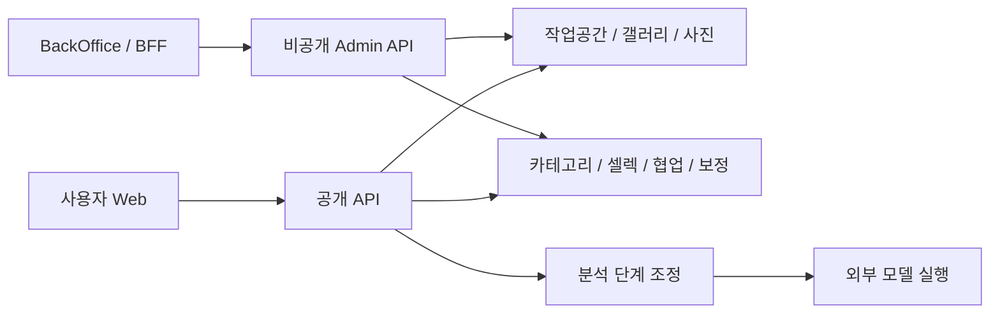

# Application — 화면과 기능

제품 API는 도메인별 책임을 나누고, 관리자 UI와 AI 모델 실행은 별도 경계를 가진다.

공개 API와 관리자 API는 코드를 공유하지만 실행·인증·네트워크를 분리한다. 외부 분석을 카테고리로 만드는 작업은 서버가 담당한다. [백엔드](../tech/server.md)·[백오피스](../tech/backoffice.md)·[AI 파이프라인](../tech/ai-pipeline.md)에 현재 계약을 기록한다.
