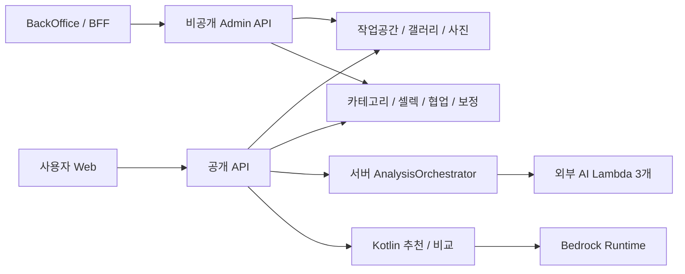

# Application — 화면과 기능

공개 API는 도메인별 책임을 나누고, 관리자 UI·관리자 API·AI 모델 실행은 실행 경계를 분리한다.

## 모듈별 책임

| 모듈 | 현재 책임 |
|:---|:---|
| 인증·작업공간 | OAuth, 컨텍스트 권한, PERSONAL 1개/여러 STUDIO, 다중 OWNER와 최종 소유자 보호, 3종 초대 |
| 갤러리·사진 | 소유 작업공간, 공개/작업/진행 상태, Presigned URL, 업로드 완료, 분석 요청·상태 |
| 카테고리 | 분석 결과를 컨셉·세부폴더·사진 배정으로 반영, 수동 배치 보존, 미분류·사진별 처리 상태 |
| 공동 셀렉·추천 | 선택 사진·순서·추가자·원본/보정본, 제출 잠금·철회, Kotlin 추천/비교와 사용자 수락 |
| 협업 | 컨셉당 세션 1개, USER/GUEST 통합 참여자, 현재 사진 소속과 반응 권한 |
| 보정 | 회차·annotation·결과 파일, 고객 요청과 스튜디오 처리 권한, 완료 후 DELIVERY |
| 삭제·리비전 | 7일 휴지통·복구, DB/S3 purge와 실패 추적, 운영 변경 이력 |
| 사용자 알림 | 셀렉·보정·구성원 변경 알림 저장, 범위별 조회, 이메일/브라우저 수신 설정 |

외부 이메일·브라우저 발송 정책은 미정이다. 사용자 알림 저장을 외부 자동 발송 완료로 설명하지 않는다.

---

## 독립 실행 경계

- 공개 API와 `wes-admin-api`는 도메인 코드·PostgreSQL을 공유하지만 실행·인증·네트워크를 분리한다.
- BackOffice BFF는 관리자 브라우저의 동일 출처 요청을 중계한다. BFF에는 AWS 자격 증명을 주지 않는다.
- 모델 코드는 WES-AI의 Embedder·Score·Categorize Lambda가 소유한다. 분석 결과를 카테고리로 반영하는 작업은 서버가 수행한다.
- AI 추천·비교는 서버 Kotlin과 Bedrock을 사용한다. 사진 분석 Lambda 작업과 자동 제출로 연결하지 않는다.

[프론트엔드](../tech/web.md)의 현재 Web main에는 구 계약이 남아 있다. PERSONAL MEMBER 권한, 별점 제출 잠금/버전 검사, 공개 보정 제출 리비전 차이는 [구현 기준](../implementation-status.md)에 기록한다.

---

## 승인된 상세 아키텍처

기존 Draw.io의 도형·색상·글꼴·배치를 유지한 2026-09-05 원본이다. 이미지를 누르면 전체 크기로 볼 수 있다.

[전체 이미지]({{ site.baseurl }}/assets/img/architecture/wes-application-architecture.png) · [Draw.io 원본]({{ site.baseurl }}/assets/diagrams/wes-application-architecture.drawio)

{: .architecture-preview }

[백엔드](../tech/server.md) · [백오피스](../tech/backoffice.md) · [AI 파이프라인](../tech/ai-pipeline.md)
