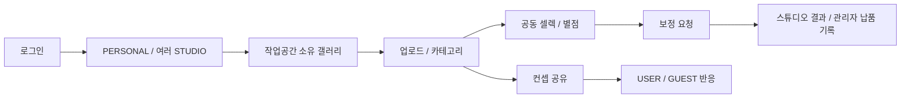

# Information — 사용자 여정

현재 여정은 작업공간·갤러리 관계에서 권한을 계산한다. 가입 경로가 전역 작가/고객 역할을 결정하지 않는다.

PERSONAL OWNER는 업로드·카테고리 운영과 고객 셀렉을 모두 할 수 있다. STUDIO OWNER/MEMBER는 운영·보정 결과를 처리하고 고객 셀렉을 편집하지 않는다. 상세 권한은 [제품 정책](../product/policies.md)을 따른다. 현재 Web은 이 서버 여정 전체와 일치하지 않는다. → [프론트엔드](../tech/web.md)
