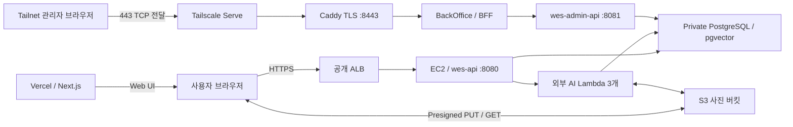

# System — 시스템 구성

사용자 Web은 Vercel에서 제공하고, 공개 API·비공개 관리자·외부 AI 워커는 각각의 실행 경계에서 공통 데이터에 접근한다.

## 요청과 데이터 경로

1. Route 53은 공개 ALB 주소를 해석한다. 브라우저의 HTTPS 요청은 ALB를 거쳐 공개 EC2 API에 도달한다.
2. 사진은 브라우저가 S3와 직접 전송한다. 완료 통지도 브라우저가 API에 보내며 S3 이벤트가 전체 분석을 자동 시작하지 않는다.
3. 명시적 분석 요청이 DB job을 만든 뒤 서버가 Lambda를 호출한다. Embedder는 preview·임베딩, Score는 품질 신호, Categorize는 그룹·이름을 만든다.
4. 공동 셀렉·별점·협업·보정·알림·운영 데이터는 PostgreSQL에 저장한다. 스키마는 Server Flyway V1-V6가 관리한다.
5. 관리자 브라우저는 Tailnet의 BackOffice에 접속한다. BFF만 내부 관리자 API를 호출하며 공개 ALB에는 관리자 API가 없다.

원본·preview·retouch는 같은 S3 사진 저장소의 용도다. 상세 그림의 두 S3 표기는 입출력 책임을 나눠 보여주며, 별도의 결과 버킷 두 개를 뜻하지 않는다. 기본 암호화는 SSE-S3(AES256)다.

---

## AI와 관측

현재 서버 기본값은 `lambda-reports-stage=false`다. FULL은 서버가 EMBED 완료를 관측해 SCORE를 호출하고, Score가 Categorize를 직접 EVENT 호출한다. 단계별 `stage_status`·heartbeat 제어는 서버에 준비되어 있지만 AI main에는 아직 반영되지 않았다. → [AI 파이프라인](../tech/ai-pipeline.md)

AI 추천·비교는 서버 Kotlin + Bedrock이며 사진 분석 Lambda와 분리한다. 앱 로그는 별도 모니터링 EC2의 Loki·Grafana/Caddy, Lambda 로그·실행 지표는 CloudWatch가 담당한다. 현재 코드 기준에 Prometheus·Step Functions·AWS Batch·SQS DLQ를 포함하지 않는다.

---

## 승인된 상세 아키텍처

기존 Draw.io의 도형·색상·글꼴·배치를 유지한 2026-09-05 원본이다. 이미지를 누르면 전체 크기로 볼 수 있다.

[전체 이미지]({{ site.baseurl }}/assets/img/architecture/wes-system-architecture.png) · [Draw.io 원본]({{ site.baseurl }}/assets/diagrams/wes-system-architecture.drawio)

{: .architecture-preview }

이 그림은 확인한 원격 소스의 실행 구조다. 사용자 Web 연동, 운영 워커 배포 SHA와 실제 접속 검증 범위는 [구현 상태](../implementation-status.md)를 따른다.
