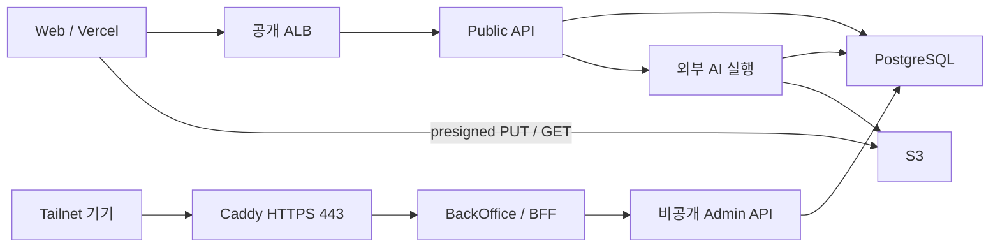

# System — 시스템 구성

사용자 Web, 공개 API, 비공개 관리자 서비스와 외부 AI 워커를 분리한다.

브라우저는 관리자 API에 직접 접속하지 않는다. BFF가 비공개 네트워크의 API를 호출한다. 모델 실행은 제품 API 배포와 독립이다. → [관리자 경계](../decisions/adr-011-private-admin-network.md)

## 구현 기준

사진은 presigned URL로 S3에 직접 전송한다. API와 관리자 실행 프로세스는 분리하며 모델은 외부 실행기가 처리한다. 세부 리소스와 운영 확인 범위는 [인프라](../tech/infra.md)와 [구현 상태](../implementation-status.md)를 따른다.
