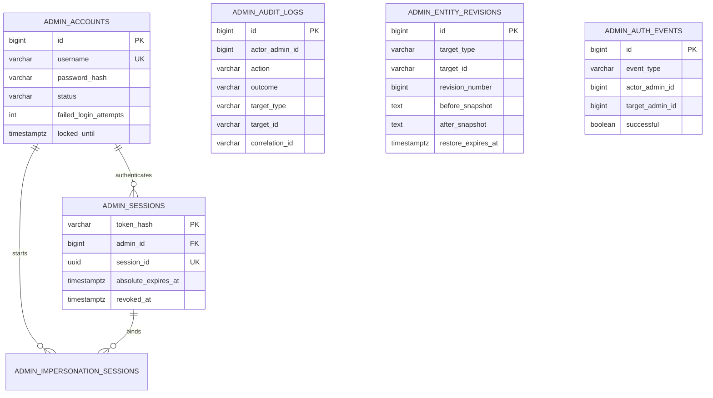

# 관리자 인증·감사

최고 관리자 인증은 사용자 JWT와 분리한다. 모든 민감 조회와 변경은 관리자 세션, 사유, 상관 ID와 감사 로그로 추적한다.

## 기능과 책임

- `ADMIN_ACCOUNTS`, `ADMIN_SESSIONS`, `ADMIN_AUTH_EVENTS`는 관리자 로그인과 잠금을 저장한다.
- `ADMIN_AUDIT_LOGS`는 성공·실패 작업의 비식별 메타데이터를 영구 보존한다.
- `ADMIN_ENTITY_REVISIONS`는 제한된 복원 창을 위한 정제 스냅샷을 저장한다.
- `ADMIN_IMPERSONATION_SESSIONS`는 읽기 전용 사용자 관점 대리보기를 저장한다.

## Mermaid ERD

## 테이블과 주요 컬럼

| 테이블 | 주요 컬럼 | 설명 |
|:---|:---|:---|
| `admin_accounts` | 사용자명, Argon2id 해시, 상태, 실패 횟수, 잠금 시각 | 최고 관리자 계정이다. |
| `admin_sessions` | 토큰 해시 PK, 세션 UUID, 관리자 FK, 절대·유휴 만료, 폐기 시각 | HttpOnly 관리자 세션이다. |
| `admin_auth_events` | 결과, 소스, 발생 시각 | 로그인·잠금 보안 이벤트다. |
| `admin_audit_logs` | 작업, 결과, 대상, 사유 분류, 변경 필드, 상관 ID | 영구 감사 증거다. |
| `admin_entity_revisions` | 정제 전후 스냅샷, 리비전 번호, 복원 payload와 만료 시각 | 제한된 복원 데이터다. 감사 로그와 상관 값으로 추적하며 직접 FK로 묶지 않는다. |
| `admin_impersonation_sessions` | 관리자, 대상, 조회 사용자, 만료 시각 | 읽기 전용 대리보기다. |

## 키와 업무 불변식

- 세션 원문은 저장하지 않고 해시만 저장한다.
- 로그인 실패 누적은 계정을 잠그고 기존 세션을 폐기한다.
- 감사 저장 실패 시 실제 변경도 롤백한다.
- `admin_audit_logs.actor_admin_id`에는 FK를 두지 않는다. 관리자 삭제와 별개로 영구 기록의 식별 정보·스냅샷을 보존한다.
- 영구 감사 스냅샷은 PII·secret·presigned URL·원본 콘텐츠를 allowlist로 제거한다.
- 대리보기 중 모든 쓰기는 UI와 서버에서 차단한다.

## 권한과 상태 전이

- 관리자 계정은 `ACTIVE | SUSPENDED`, 세션은 발급·만료·폐기 상태를 가진다.
- 대리보기는 최고 관리자 세션에 결속하고 수동 종료·자연 만료를 각각 감사한다.
- Tailnet 443은 BackOffice 진입점이다. 관리자 API는 동일 출처 BFF 뒤의 비공개 네트워크에서만 호출하며 공개 ALB에 노출하지 않는다.

## 구현 기준

Server `bc8948a`의 V1-V6와 BackOffice `16b19e8` 소스를 기준으로 한다. Web `7bd2c65`의 소비 계약 차이와 배포 확인 범위는 [구현 기준과 확인 상태](../implementation-status.md)에 기록한다.

## 관련 API·ADR

- API: `/internal/admin/v1/auth`, `/admins`, `/audit-logs`, `/impersonations`
- [ADR-011 — 관리자 전용 네트워크](../decisions/adr-011-private-admin-network.md)
- [인프라](../tech/infra.md)
