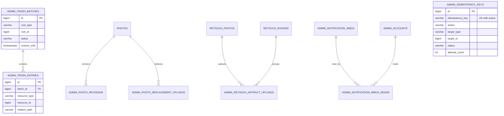

# 관리자 운영

관리자 운영 모델은 제품 행을 직접 임의 수정하지 않는다. 멱등 작업, 낙관적 잠금, 휴지통, 리비전과 산출물 업로드 절차로 변경을 통제한다.

## 기능과 책임

- `ADMIN_IDEMPOTENCY_KEYS`, `ADMIN_PROCESSING_JOBS`는 재처리와 외부 작업을 통제한다.
- `ADMIN_TRASH_BATCHES`, `ADMIN_TRASH_ENTRIES`, `ADMIN_CHILD_TRASH_RECORDS`는 연쇄·독립 삭제와 복원을 저장한다.
- `ADMIN_PHOTO_REVISIONS`, `ADMIN_PHOTO_REPLACEMENT_UPLOADS`는 원본 교체 이력을 저장한다.
- `ADMIN_RETOUCH_ARTIFACT_UPLOADS`는 주석·결과 파일의 2단계 업로드를 저장한다.
- `ADMIN_NOTIFICATION_INBOX`, `ADMIN_NOTIFICATION_INBOX_READS`는 관리자별 운영 알림을 저장한다.

## Mermaid ERD

## 테이블과 주요 컬럼

| 테이블 | 주요 컬럼 | 설명 |
|:---|:---|:---|
| `admin_idempotency_keys` | 멱등 키, 작업, 대상, payload 해시, 상태, 시도 횟수 | 동일 요청의 중복 실행을 막는다. |
| `admin_processing_jobs` | 유형, 대상, payload, claim, 상태, 실패 코드 | 파생본·임베딩·품질 작업을 추적한다. |
| `admin_trash_batches/entries` | 루트, 관계 경로, 복원·삭제 마감 | 연쇄 삭제의 정확한 범위를 고정한다. |
| `admin_child_trash_records` | 댓글·좋아요·보정 항목, 부모, 마감 | 독립 자식 복원을 추적한다. |
| `admin_photo_revisions` | 사진, 리비전, 이전 객체 메타데이터 | 원본을 덮어쓰지 않고 교체한다. |
| `admin_retouch_artifact_uploads` | 항목, 유형, 업로드 상태·객체 메타데이터 | 산출물 presigned 업로드를 2단계로 완료한다. |
| `admin_notification_inbox/reads` | 이벤트, 대상, 관리자별 읽음 | 외부 메시지 없이 운영 인박스를 제공한다. |

## 키와 업무 불변식

- 멱등 요청의 유일성은 `(action, idempotency_key)` 복합 UK다. 같은 작업·키로 payload가 달라지면 `409`로 거부한다.
- 관리자 변경은 `expectedVersion`을 검사한다. 오래된 화면의 쓰기를 허용하지 않는다.
- 휴지통 배치는 삭제 시점의 활성 자식만 묶는다. 다른 배치가 선점한 자식과 충돌하지 않는다.
- 영구 삭제 실패는 backoff 후 재시도하고 반복 실패는 운영자 조치 상태로 격리한다.

## 권한과 상태 전이

- 최고 관리자만 `/internal/admin/v1` 운영 API를 사용한다.
- 처리 작업은 `PENDING | DISPATCHING | DISPATCHED | SUCCEEDED | FAILED | CANCELED`를 사용한다.
- 멱등 요청은 `PENDING | COMPLETED | FAILED | CANCELED`를 사용한다. 서로 다른 테이블의 상태를 하나의 상태 머신으로 섞지 않는다.
- 휴지통은 `ACTIVE → RESTORED` 또는 `ACTIVE → PURGING → PURGED`로 전이한다.

## 구현 기준

Server `bc8948a`의 V1-V6와 BackOffice `16b19e8` 소스를 기준으로 한다. Web `7bd2c65`의 소비 계약 차이와 배포 확인 범위는 [구현 기준과 확인 상태](../implementation-status.md)에 기록한다.

## 관련 API·ADR

- API: `/internal/admin/v1/resources`, `/workflows`, `/operations/overview`, `/operations/trash`, `/notifications`
- [관리자 인증·감사](admin-auth-audit.md)
- [ADR-011 — 관리자 전용 네트워크](../decisions/adr-011-private-admin-network.md)
