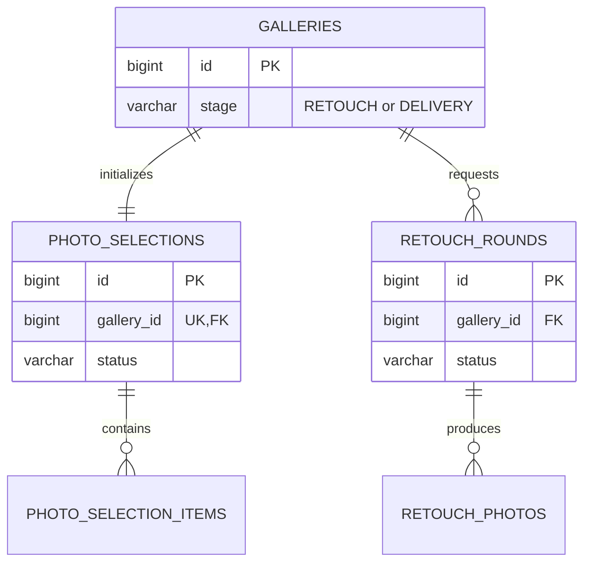

# 앨범 기능 제거

앨범 기능은 명시적으로 삭제했다. 현재 제품·서버·웹·BackOffice 데이터 모델에는 앨범, 앨범 폴더, 앨범 템플릿, 목업이 없다.

## 기능과 책임

이 문서의 책임은 삭제 결정을 숨기지 않고 경계를 고정하는 것이다. 셀렉 결과는 보정과 납품으로 이어지며 앨범 편집 단계로 가지 않는다.

## Mermaid ERD

## 제거한 테이블과 남은 경계

| 구분 | 이름 | 상태 |
|:---|:---|:---|
| 제거 | `photo_folder_groups` | V2에서 DROP |
| 제거 | `photo_folders` | V2에서 DROP |
| 제거 | `photo_folder_items` | V2에서 DROP |
| 제거 | `admin_album_templates` | V2에서 DROP |
| 제거 | 관리자 `ALBUM`, `ALBUM_TEMPLATE`, `MOCK_RECALCULATION` 계약 | 서버·BackOffice에서 제거 |
| 유지 | `photo_selections`, `photo_selection_items` | 최종 사진 선택 기능 |
| 유지 | `retouch_rounds`, `retouch_photos` | 보정 요청과 결과 처리 |
| 변경 | `galleries.stage` | 기존 `ALBUM` 값을 V6에서 `DELIVERY`로 변환 |

## 키와 업무 불변식

- 앨범 기능을 복구하는 호환 API나 테이블을 두지 않는다.
- `folder`를 카테고리 별칭으로 재사용하지 않는다. 카테고리는 `concept_folders`, `detail_folders`로만 표현한다.
- 과거 관리자 감사 로그는 기록 보존을 위해 남기되 현재 리소스 열거형에는 `ALBUM`이 없다.
- 새 기능이 앨범 배치가 필요하면 별도 ADR과 신규 마이그레이션으로 다시 결정한다.

## 권한과 상태 전이

현재 갤러리 화면 단계는 `RETOUCH → DELIVERY → ARCHIVED`다. 앨범 편집 권한과 전이는 존재하지 않는다.

## 구현 SHA

Server `c4c89a7`, Web `92babf2`, BackOffice `9a21cfb`를 기준으로 한다. 앨범 삭제와 회귀 검증은 완료했고 V6·Web·BackOffice 운영 배포는 미확인이다.

## 관련 API·ADR

- 관련 API: 셀렉 `/api/v1/galleries/{galleryId}/photo-selection`, 보정 `/api/v1/galleries/{galleryId}/retouch`
- [ADR-012 — 앨범 기능 제거](../decisions/adr-012-remove-album-feature.md)
- [셀렉션·추천](selection-recommendation.md)
- [보정](retouch.md)
