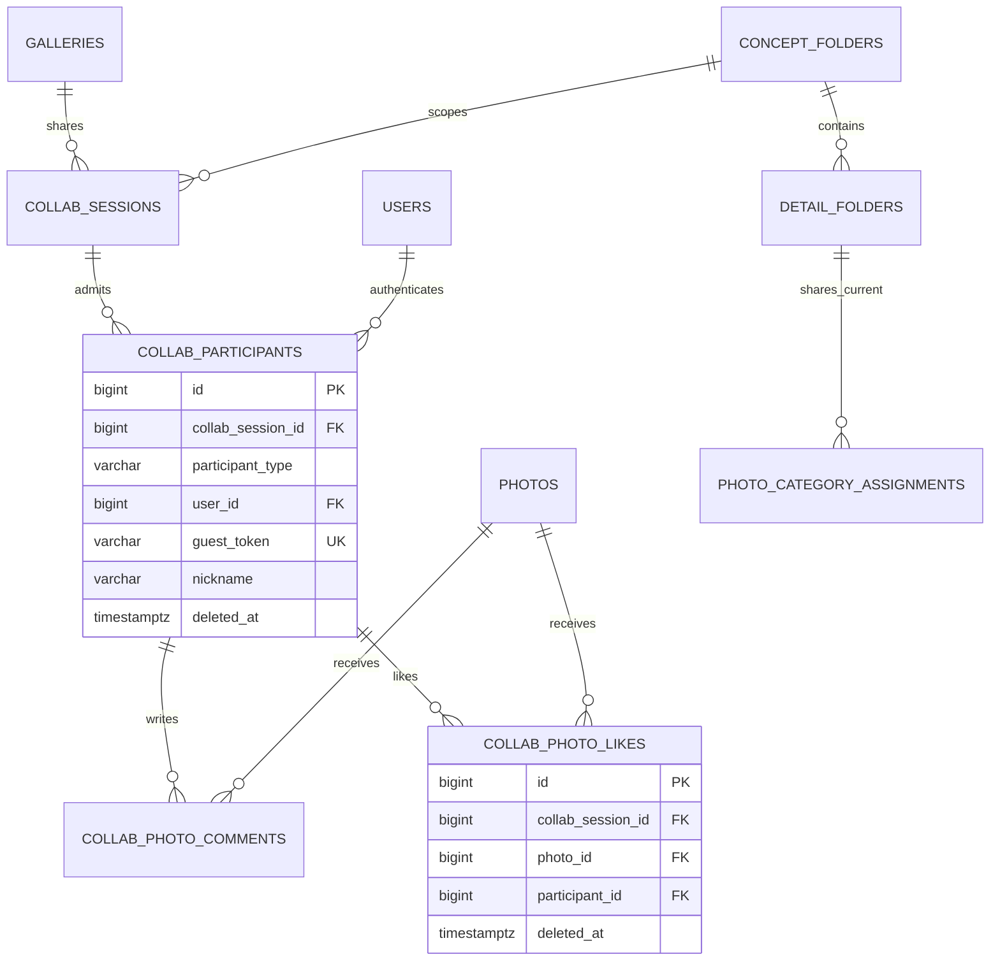

# 협업 참여자·댓글·좋아요

협업은 로그인 사용자와 비로그인 게스트를 같은 참여자 모델로 처리한다. 댓글과 좋아요는 신원별 테이블이 아니라 `participant_id` 하나를 참조한다.

## 기능과 책임

- `COLLAB_SESSIONS`는 갤러리와 컨셉 공유 링크를 저장한다.
- `COLLAB_PARTICIPANTS`는 `USER | GUEST` 신원을 통합한다.
- `COLLAB_PHOTO_COMMENTS`, `COLLAB_PHOTO_LIKES`는 참여자의 반응을 저장한다.
- 공유 사진은 세션에 복사하지 않는다. 컨셉의 현재 카테고리 배정에서 동적으로 계산한다.

## Mermaid ERD

## 테이블과 주요 컬럼

| 테이블 | 주요 컬럼 | 설명 |
|:---|:---|:---|
| `collab_sessions` | `gallery_id`, `concept_folder_id`, `collab_token`, `expires_at`, `revoked_at` | 컨셉 범위의 공유 링크다. |
| `collab_participants` | `collab_session_id`, `participant_type`, `user_id`, `guest_token`, `nickname` | 사용자와 게스트 통합 신원이다. |
| `collab_photo_comments` | `collab_session_id`, `photo_id`, `participant_id`, `content`, `deleted_at` | 작성자 추적 가능한 댓글이다. |
| `collab_photo_likes` | `collab_session_id`, `photo_id`, `participant_id`, `deleted_at` | 참여자별 활성 좋아요다. |

## 키와 업무 불변식

- `USER` 참여자는 `user_id`만, `GUEST` 참여자는 `guest_token`만 가진다. CHECK 제약이 두 방식을 상호 배타적으로 만든다.
- 활성 사용자 참여자는 세션·사용자당 하나다. 게스트 토큰은 전역에서 유일하다.
- 활성 좋아요는 세션·사진·참여자당 하나다.
- 댓글·좋아요의 `participant_id`는 NOT NULL이다. 레거시 `collab_guests`와 `collab_guest_id`는 V6에서 삭제했다.
- 세션에 Authorization과 게스트 토큰이 모두 오면 Bearer를 우선한다. 잘못된 Bearer는 게스트로 강등하지 않고 `401`을 반환한다.

## 권한과 상태 전이

- PERSONAL/STUDIO OWNER, 활성 GALLERY_MEMBER, 정상 게스트가 반응을 작성한다.
- STUDIO MEMBER는 협업을 조회하지만 댓글·좋아요를 작성하지 않는다.
- 링크는 발급·폐기·재발급할 수 있다. 댓글과 좋아요는 7일 복구 가능한 휴지통을 사용한다.

## 구현 SHA

Server `bc8948a`, Web `4438237`, BackOffice `16b19e8`을 기준으로 한다. 통합 참여자와 Bearer 우선순위 구현을 완료했으며 Server V6와 BackOffice는 운영 배포했다.

## 관련 API·ADR

- API: `/api/v1/collab/{collabToken}`, `/photos`, `/photos/{photoId}/comments`, `/photos/{photoId}/like`, `/api/v1/galleries/{galleryId}/collab-sessions`
- [ADR-008 — 컨텍스트 역할과 다중 작업공간](../decisions/adr-008-contextual-roles-workspaces.md)
- [제품 정책](../product/policies.md)
