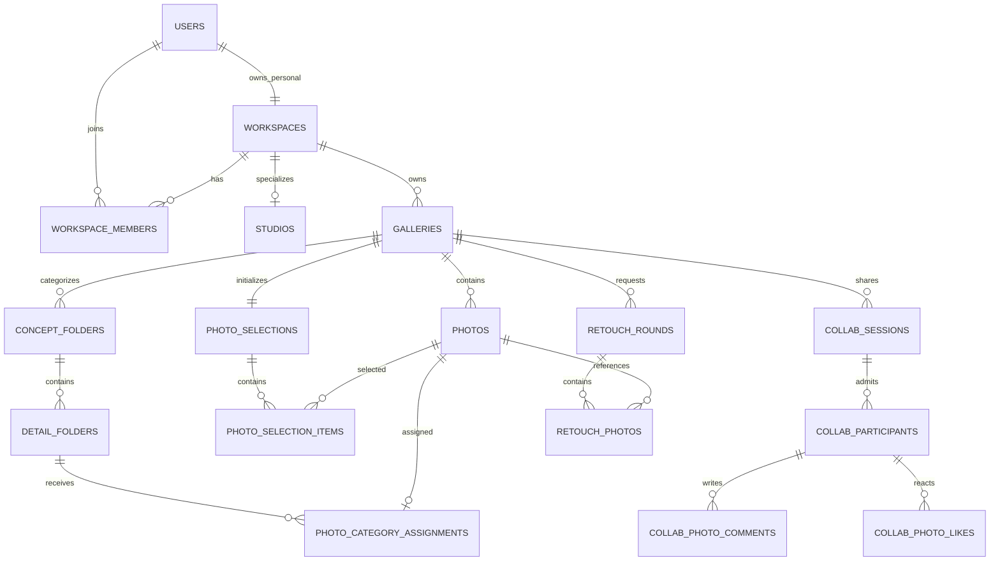

# 데이터 모델

WES 데이터 모델은 `사용자 → 작업공간 → 갤러리`를 소유권의 줄기로 삼고, 갤러리 아래에서 사진·카테고리·셀렉·협업·보정을 분리한다. 이 페이지는 전체를 보여주고, 하위 문서는 기능별 불변식과 권한을 설명한다.

{: .highlight }
기준 구현은 Server `c4c89a7`, Web `92babf2`, BackOffice `9a21cfb`, Infra `cfbd72e`다. Server V5 `666c002`와 Infra는 운영 반영·병합했고, V6·Web·BackOffice·DOCS는 로컬 구현과 검증까지만 완료했다.

## 읽는 순서

| 순서 | 문서 | 핵심 질문 |
|:---:|:---|:---|
| 1 | 이 페이지 | 전체 데이터가 어떻게 이어지는가 |
| 2 | [사용자·작업공간·갤러리](user-workspace-gallery.md) | 누가 무엇을 소유하고 접근하는가 |
| 3 | [사진·AI 분석·카테고리](photo-ai-category.md) | 사진을 어떻게 분석하고 분류하는가 |
| 4 | [셀렉션·추천](selection-recommendation.md) | 선택 결과와 추천 초안을 어떻게 보존하는가 |
| 5 | [협업 참여자·댓글·좋아요](collaboration.md) | 로그인 사용자와 게스트를 어떻게 통합하는가 |
| 6 | [앨범 기능 제거](album-removal.md) | 삭제한 앨범 모델과 대체 경계는 무엇인가 |
| 7 | [보정](retouch.md) | 고객 요청과 스튜디오 결과 처리를 어떻게 분리하는가 |
| 8 | [수명주기·알림](lifecycle-notification.md) | 삭제·복원·알림을 어떻게 추적하는가 |
| 9 | [관리자 인증·감사](admin-auth-audit.md) | 최고 관리자 접근과 감사를 어떻게 보호하는가 |
| 10 | [관리자 운영](admin-operations.md) | 멱등 작업·휴지통·재처리를 어떻게 운영하는가 |

## 전체 ERD

## 핵심 불변식

- 사용자는 전역 직무 역할을 가지지 않는다. 권한은 작업공간과 갤러리 관계에서 계산한다.
- PERSONAL 작업공간은 사용자 한 명이 소유한다. STUDIO 작업공간은 여러 OWNER를 허용하되 마지막 OWNER를 제거하지 않는다.
- 갤러리는 작업공간이 소유한다. 여러 스튜디오에 참여한 사용자는 현재 작업공간을 명시해 갤러리를 만든다.
- 카테고리·분류 작업·셀렉 항목은 `gallery_id`를 포함한 복합 FK로 다른 갤러리의 행을 참조하지 못한다.
- 갤러리를 만들 때 `SELECTING` 셀렉도 하나 만든다.
- 협업 반응은 `USER | GUEST` 통합 참여자를 참조한다.
- 앨범 테이블과 API는 의도적으로 삭제했다. `folder`라는 별도 앨범 도메인도 남기지 않는다.
- 보정 요청 작성자는 고객 측이고, 결과 업로드·완료·납품 처리자는 스튜디오 측이다.

## 구현 기준과 배포 상태

| 저장소 | 기준 SHA | 확인 상태 |
|:---|:---|:---|
| WES-Server | `c4c89a7` | Java 21 테스트 537개 통과, Flyway V1→V6 및 Hibernate 검증 통과. V5 `666c002` 운영 배포 완료 |
| WES-Web | `92babf2` | lint, TypeScript, Next 프로덕션 빌드 통과 |
| WES-BackOffice | `9a21cfb` | 테스트 44개, lint, typecheck, Next 빌드 통과 |
| WES-Infra | `cfbd72e` | PR #22 병합, CI 통과, 기능 Terraform 변경 없음 |
| WES-DOCS | 현재 브랜치 | 문서 빌드·링크·Mermaid 검증 후 커밋 예정 |

## 관련 문서

- [제품 개념](../product/concepts.md)
- [백엔드 구현](../tech/server.md)
- [ADR 목록](../decisions/index.md)
- [현재 아키텍처와 역사적 스냅샷](../architecture/index.md)
