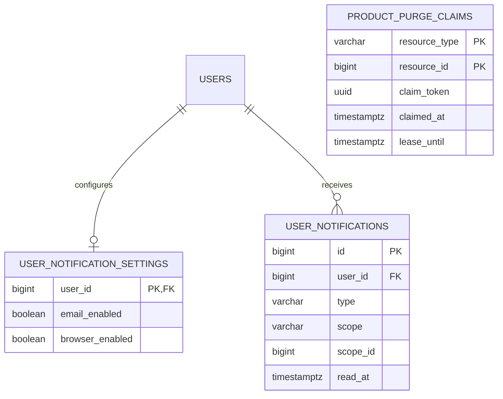

# 수명주기·알림

제품 삭제는 즉시 물리 삭제하지 않고 관계를 보존한 뒤 정해진 기간에 정리한다. 알림은 사용자 수신함과 운영자 인박스를 분리한다.

## 기능과 책임

- 각 제품 테이블의 `deleted_at`은 서비스 노출을 중단한다.
- `PRODUCT_PURGE_CLAIMS`는 영구 삭제 작업의 선점과 재시도를 조정한다.
- `USER_NOTIFICATION_SETTINGS`, `USER_NOTIFICATIONS`는 사용자 알림 설정과 읽음 상태를 저장한다.
- `ADMIN_NOTIFICATION_OUTBOX`와 관리자 인박스는 운영 알림을 저장한다.
- 관리자 휴지통 묶음은 [관리자 운영](admin-operations.md)에서 설명한다.

## Mermaid ERD

## 테이블과 주요 컬럼

| 테이블 | 주요 컬럼 | 설명 |
|:---|:---|:---|
| 제품 루트·자식 테이블 | `deleted_at`, `version` | 논리 삭제와 낙관적 잠금을 제공한다. |
| `product_purge_claims` | `resource_type`, `resource_id`, `claim_token`, `claimed_at`, `lease_until` | GALLERY·PHOTO purge 작업의 중복 실행을 lease로 막는다. 다형 참조라 제품 행 FK는 두지 않는다. |
| `user_notification_settings` | `user_id`, 채널별 활성 값 | 사용자별 수신 설정이다. |
| `user_notifications` | `user_id`, `type`, `scope`, `scope_id`, `read_at` | 사용자 수신함이다. |
| `admin_notification_outbox` | 이벤트 유형, 대상과 전달 상태 | 트랜잭션 이후 전달할 이벤트다. |

## 키와 업무 불변식

- 논리 삭제된 행은 기본 조회에서 제외한다. 기본 복원 기간은 삭제 시각부터 7일이다. 기간 경과 후(8일 차) purge가 DB 행과 S3 객체를 정리한다. 실행 주기·재시도 때문에 정확히 7일째 완료를 보장하는 SLA는 아니다.
- `user_notifications.scope_id`는 GLOBAL/STUDIO/GALLERY 다형 참조이며 갤러리 FK가 아니다. GLOBAL이면 NULL이고 나머지는 값을 요구한다.
- PERSONAL 사용자 탈퇴는 개인 작업공간과 소유 갤러리를 삭제 대상으로 만든다. STUDIO는 소유자를 검증하고 멤버십만 제거한다.
- 마지막 STUDIO OWNER가 남지 않는 삭제는 관리자 경로에서도 거부한다.
- 알림 payload와 감사 스냅샷에는 비밀번호·토큰·원본 객체 키를 남기지 않는다.
- 영구 삭제 실패는 lease 만료 뒤 안전하게 다시 claim한다.

## 권한과 상태 전이

- 사용자는 자신의 알림과 설정만 조회·수정한다.
- 관리자 알림은 내부 API와 최고 관리자 세션으로만 접근한다.
- 삭제는 `ACTIVE → logically deleted → purge eligible → PURGED` 흐름이며, 복원 가능한 항목은 기간 안에만 되돌린다.

## 구현 기준

Server `bc8948a`의 V1-V6와 BackOffice `16b19e8` 소스를 기준으로 한다. Web `7bd2c65`의 소비 계약 차이와 배포 확인 범위는 [구현 기준과 확인 상태](../implementation-status.md)에 기록한다.

## 관련 API·ADR

- API: `GET /api/v1/notifications`, `GET/PUT /api/v1/notifications/settings`, `DELETE /api/v1/users/me`, `/internal/admin/v1/operations/trash`
- [관리자 운영](admin-operations.md)
- [ADR-011 — 관리자 전용 네트워크](../decisions/adr-011-private-admin-network.md)
