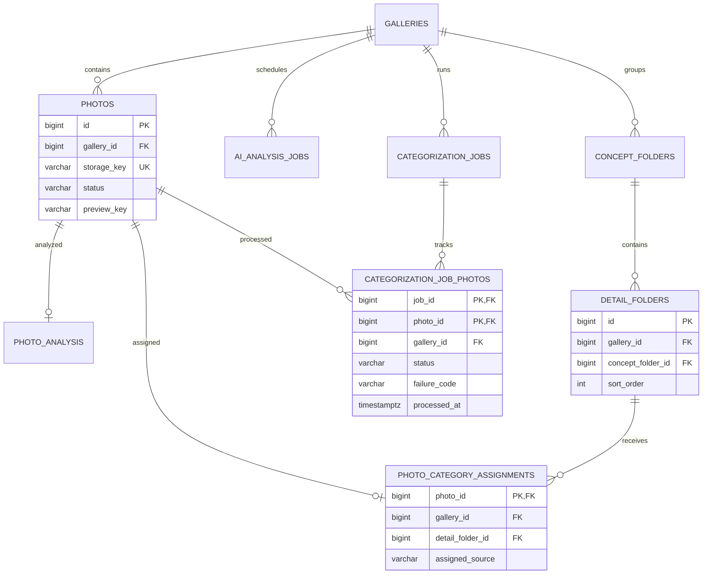

# 사진·AI 분석·카테고리

사진은 갤러리에 속하고, AI 결과와 사람이 편집하는 카테고리는 분리한다. 카테고리는 `컨셉 → 세부 → 사진 배정` 3단계다.

## 기능과 책임

- `PHOTOS`는 원본 메타데이터와 S3 키를 저장한다.
- `PHOTO_ANALYSIS`는 외부 AI 워커가 만든 임베딩·기술 품질 결과를 저장한다.
- `AI_ANALYSIS_JOBS`는 외부 워커 실행 상태를 저장한다.
- `CONCEPT_FOLDERS`, `DETAIL_FOLDERS`, `PHOTO_CATEGORY_ASSIGNMENTS`는 편집 가능한 카테고리 트리를 저장한다.
- `AI_CONCEPT_ASSIGNMENTS`는 외부 분석이 제안한 컨셉 결과다. 제품 서버가 이를 읽어 편집 가능한 카테고리를 만든다.
- `CATEGORIZATION_JOBS`, `CATEGORIZATION_JOB_PHOTOS`는 서버의 카테고리 생성 작업과 사진별 결과를 저장한다.

## Mermaid ERD

## 테이블과 주요 컬럼

| 테이블 | 주요 컬럼 | 설명 |
|:---|:---|:---|
| `photos` | `gallery_id`, `storage_key`, `preview_key`, `status`, EXIF 필드 | 원본과 표시용 파생본의 메타데이터다. |
| `photo_analysis` | `photo_id`, `embedding`, 품질 신호, `model_version`, `analyzed_at` | AI 분석 결과다. 제품 서버가 모델을 실행하지 않는다. |
| `ai_analysis_jobs` | `gallery_id`, `mode`, `status`, `stage`, `stage_status`, 시도·heartbeat | 서버가 EMBED/SCORE/CATEGORIZE 실행을 조정한다. |
| `ai_concept_assignments` | 분석 작업·사진·컨셉 제안 | 편집 카테고리 생성에 쓰는 분석 결과다. |
| `concept_folders` | `gallery_id`, `name`, `sort_order`, `created_source` | 상위 컨셉이다. |
| `detail_folders` | `gallery_id`, `concept_folder_id`, `name`, `sort_order` | 실제 사진을 받는 세부 폴더다. |
| `photo_category_assignments` | `gallery_id`, `photo_id`, `detail_folder_id`, `assigned_source`, `confidence` | 사진의 현재 단일 배정이다. |
| `categorization_jobs` | `gallery_id`, `mode`, `status`, `failure_code` | `INITIAL | INCREMENTAL` 분류 작업이다. |
| `categorization_job_photos` | `gallery_id`, `job_id`, `photo_id`, `status`, `failure_code`, `processed_at` | 사진별 `PENDING | ASSIGNED | UNCLASSIFIED | FAILED` 결과다. |

## 키와 업무 불변식

- `photos(gallery_id, id)`와 각 도메인 `(gallery_id, id)` 복합 키를 FK 대상으로 사용한다.
- `detail_folders(gallery_id, concept_folder_id)`는 같은 갤러리의 컨셉만 참조한다.
- `photo_category_assignments`와 `categorization_job_photos`는 같은 갤러리의 사진·폴더·작업만 연결한다.
- 사진당 활성 카테고리 배정은 하나다. 세부 폴더를 제거하면 해당 사진은 미분류가 된다.
- 앱 서버는 외부 분석 단계를 호출하고 상태를 관측한다. 분석 결과에서 Concept/Detail/배정을 생성하는 작업은 서버가 실행한다. 모델 실행만 외부 AI 워커 저장소의 책임이다.
- `photo_analysis`는 SCORE 완료와 CATEGORIZE 결과의 전체 채움을 별도 CHECK로 검사한다. `model_version`만 있다고 전체 분석 완료는 아니다.

## 권한과 상태 전이

- PERSONAL OWNER와 STUDIO OWNER/MEMBER가 사진 업로드와 카테고리 구조를 운영한다.
- 고객 측 참여자는 카테고리를 조회하고 셀렉에 사용한다.
- 분류 작업은 `PENDING → ASSIGNED | UNCLASSIFIED | FAILED`를 사진마다 기록한다. 작업 전체 상태만으로 개별 실패를 숨기지 않는다.

## 구현 기준

Server `bc8948a`의 V1-V6와 BackOffice `16b19e8` 소스를 기준으로 한다. Web `7bd2c65`의 소비 계약 차이와 배포 확인 범위는 [구현 기준과 확인 상태](../implementation-status.md)에 기록한다.

## 관련 API·ADR

- API: `POST/GET /api/v1/galleries/{galleryId}/concept-folders`, `POST /category-assignments/move`, `POST /categorization-jobs`, `GET /categorization-jobs/latest`
- [ADR-009 — 갤러리 귀속 카테고리](../decisions/adr-009-gallery-category-model.md)
- [ADR-010 — 외부 AI 워커 경계](../decisions/adr-010-external-ai-worker.md)

{: .warning }
PERSONAL 권한은 정책과 구현에 차이가 있다. 현재 서버는 초대된 PERSONAL MEMBER도 관리·고객 편집 권한으로 통과시킨다. 위 OWNER 중심 정책을 실제 접근 제한으로 단정하지 않는다. [확인한 구현 차이](../implementation-status.md)를 따른다.
