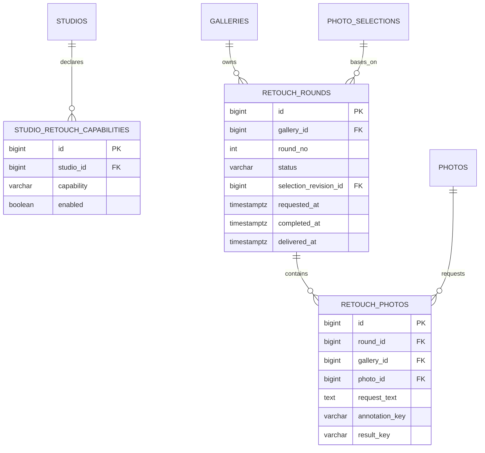

# 보정

보정은 고객 요청과 스튜디오 결과 처리를 분리한다. 같은 회차를 보더라도 작성 권한과 처리 권한은 서로 다르다.

## 기능과 책임

- `RETOUCH_ROUNDS`는 갤러리별 회차와 요청 상태를 저장한다.
- `RETOUCH_PHOTOS`는 사진별 요청 문구, 주석과 결과 객체를 저장한다.
- `STUDIO_RETOUCH_CAPABILITIES`는 스튜디오가 지원하는 보정 범위를 저장한다.
- 관리자 업로드와 리비전은 운영 테이블에서 별도로 추적한다.

## Mermaid ERD

## 테이블과 주요 컬럼

| 테이블 | 주요 컬럼 | 설명 |
|:---|:---|:---|
| `retouch_rounds` | `gallery_id`, `round_no`, `status`, 제출 리비전, 동의·요청·완료·납품 시각 | 보정 회차의 수명주기다. |
| `retouch_photos` | `round_id`, `gallery_id`, `photo_id`, `request_text`, `annotation_key`, `result_key`, `result_content_type` | 사진별 요청과 산출물 참조다. |
| `studio_retouch_capabilities` | `studio_id`, `capability`, `enabled` | 스튜디오 처리 가능 범위다. |

## 키와 업무 불변식

- 회차 번호는 갤러리 안에서 중복되지 않는다.
- 보정 항목의 갤러리, 회차와 사진은 같은 갤러리에 속해야 한다.
- S3 객체 바이트는 앱 서버를 통과하지 않는다. 서버는 제한된 presigned URL과 완료 확인을 처리한다.
- 제출 리비전은 요청 시점의 셀렉 결과에 고정해 이후 셀렉 변경과 분리한다.

## 권한과 상태 전이

- PERSONAL OWNER와 활성 GALLERY_MEMBER가 사진 추가·삭제, 요청 문구·주석 작성과 제출을 담당한다.
- STUDIO OWNER/MEMBER와 최고 관리자만 결과 업로드, 완료와 납품을 처리한다.
- PERSONAL OWNER는 스튜디오 결과 처리 권한을 갖지 않는다.
- 회차는 `DRAFTING → REQUESTED → COMPLETED`로 전이하고 납품 시각을 별도로 기록한다.

## 구현 SHA

Server `bc8948a`, Web `4438237`, BackOffice `16b19e8`을 기준으로 한다. 고객·처리자 권한 분리와 관리자 산출물 흐름을 검증했으며 Server V6와 BackOffice는 운영 배포했다.

## 관련 API·ADR

- API: `/api/v1/galleries/{galleryId}/retouch`, `/photos`, `/rounds/submit`, `/rounds/{roundNo}/results/upload-urls`, `/results/complete`, `/complete`
- [ADR-001 — presigned 직접 업로드](../decisions/adr-001-presigned-direct-upload.md)
- [제품 정책](../product/policies.md)
