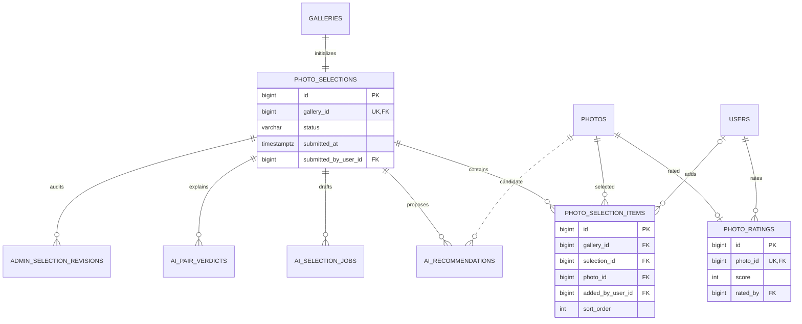

# 셀렉션·추천

셀렉은 갤러리 생성 시 함께 생기는 단일 공동 편집 결과다. 추천은 제출이 아니라 수정 가능한 초안이다.

## 기능과 책임

- `PHOTO_SELECTIONS`는 갤러리의 현재 셀렉 상태를 저장한다.
- `PHOTO_SELECTION_ITEMS`는 사진, 작성자와 정렬 순서를 저장한다.
- `PHOTO_RATINGS`는 사진별 공동 별점을 저장한다.
- `AI_SELECTION_JOBS`, `AI_RECOMMENDATIONS`, `AI_PAIR_VERDICTS`는 추천 생성과 설명 근거를 저장한다.
- 관리자용 `ADMIN_AI_SELECTION_JOBS`, `ADMIN_SELECTION_REVISIONS`는 운영 재시도와 변경 이력을 저장한다.

## Mermaid ERD

## 테이블과 주요 컬럼

| 테이블 | 주요 컬럼 | 설명 |
|:---|:---|:---|
| `photo_selections` | `gallery_id`, `status`, `submitted_at`, `submitted_by_user_id` | 갤러리당 하나인 현재 셀렉이다. |
| `photo_selection_items` | `gallery_id`, `selection_id`, `photo_id`, `added_by_user_id`, `sort_order` | 선택 사진과 공동 편집 메타데이터다. |
| `photo_ratings` | `photo_id`, `score`, `rated_by` | 사진별 현재 별점과 마지막 편집 사용자다. |
| `ai_selection_jobs` | `selection_id`, `mode`, `status`, `folder_set_job_id`, `round`, `result` | 사용자 요청 추천 작업이다. |
| `ai_recommendations` | 셀렉·사진·추천 회차·점수·순위 | 추천 후보와 순위를 저장한다. |
| `ai_pair_verdicts` | 비교 사진과 판정 근거 | 유사 후보 중 선택 근거를 저장한다. |
| `admin_selection_revisions` | `selection_id`, `revision_number`, `photo_items` | 관리자 변경과 제출 기준을 보존한다. |

## 키와 업무 불변식

- `photo_selections.gallery_id`는 유일하다. 갤러리 생성 트랜잭션에서 `SELECTING` 행을 만든다.
- `photo_selection_items(selection_id, photo_id)`와 `(selection_id, sort_order)`는 중복되지 않는다.
- 항목의 `(gallery_id, selection_id)`와 `(gallery_id, photo_id)` 복합 FK가 교차 갤러리 연결을 막는다.
- `added_by_user_id`는 삭제된 사용자를 보존할 수 있도록 `ON DELETE SET NULL`이다.
- 추천·비교 판정은 `selection_id` FK를 참조한다. `job_id` FK는 없고 추천의 `photo_id`와 비교 사진 ID는 논리 참조다.
- 추천은 현재 선택을 보존하고 부족한 후보만 제안한다. 자동 제출하지 않는다.
- 별점은 사진당 공동 결과 하나이며 `rated_by`가 마지막 편집자를 기록한다. 점수는 1-5이고 삭제로 별점을 해제한다.

## 권한과 상태 전이

- STUDIO 구성원은 셀렉과 별점을 조회하지만 편집하지 않는다.
- PERSONAL OWNER와 활성 GALLERY_MEMBER만 셀렉·별점을 편집한다.
- 현재 별점 API는 OPEN·마감과 편집 권한만 검사하며 SUBMITTED 잠금·클라이언트 예상 버전을 검사하지 않는다. `rated_by`는 마지막 쓰기를 기록한다.
- 상태는 `SELECTING → SUBMITTED`다. 갤러리가 OPEN이고 마감 전인 고객 측 편집자만 추가·삭제·제출한다. 제출 뒤 셀렉 항목은 잠긴다.
- 제출 철회는 PERSONAL OWNER 또는 STUDIO OWNER/MEMBER인 운영자만 수행하고 `SELECTING`으로 돌린다. 갤러리 CLOSED→OPEN 재오픈은 별도 작업이다.

## 구현 기준

Server `bc8948a`의 V1-V6와 BackOffice `16b19e8` 소스를 기준으로 한다. Web `7bd2c65`의 소비 계약 차이와 배포 확인 범위는 [구현 기준과 확인 상태](../implementation-status.md)에 기록한다.

## 관련 API·ADR

- API: `GET /api/v1/galleries/{galleryId}/photo-selection`, `POST/DELETE /photo-selection/photos`, `POST /photo-selection/submit`, `POST /photo-selection/withdraw`, `PUT/DELETE /photos/{photoId}/rating`
- [사용자·작업공간·갤러리](user-workspace-gallery.md)
- [ADR-010 — 외부 AI 워커 경계](../decisions/adr-010-external-ai-worker.md)

{: .warning }
PERSONAL 권한은 정책과 구현에 차이가 있다. 현재 서버는 초대된 PERSONAL MEMBER도 관리·고객 편집 권한으로 통과시킨다. 위 OWNER 중심 정책을 실제 접근 제한으로 단정하지 않는다. [확인한 구현 차이](../implementation-status.md)를 따른다.
