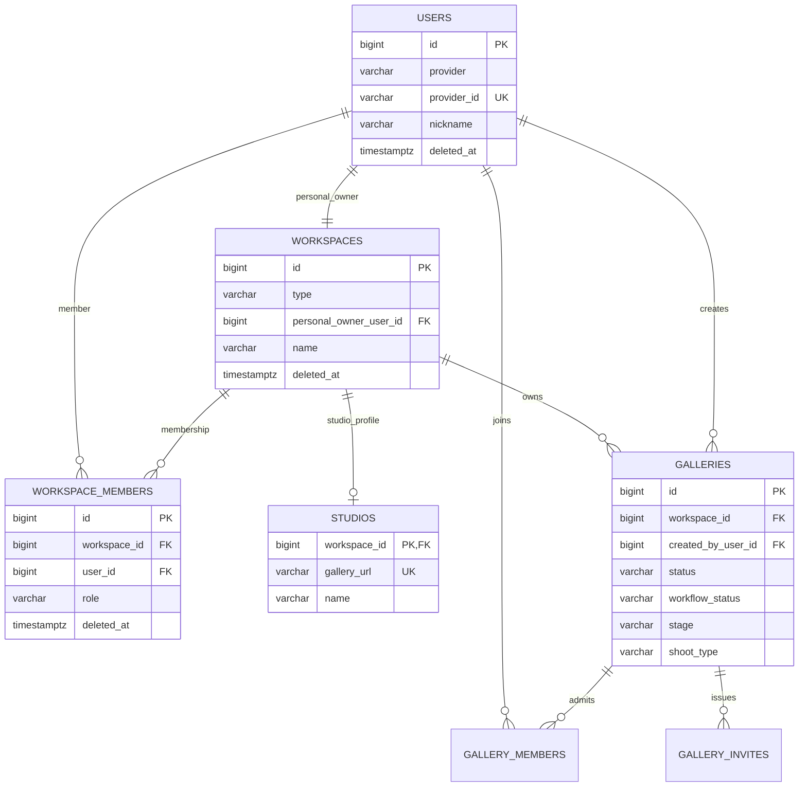

# 사용자·작업공간·갤러리

사용자는 계정이고, 작업공간은 소유·운영 경계이며, 갤러리는 한 촬영 건의 업무 경계다. 전역 `PHOTOGRAPHER`·`CLIENT` 역할은 사용하지 않는다.

## 기능과 책임

- `USERS`는 로그인 신원과 프로필을 저장한다.
- `WORKSPACES`는 `PERSONAL | STUDIO` 유형과 이름을 저장한다.
- `WORKSPACE_MEMBERS`는 STUDIO 구성원의 `OWNER | MEMBER` 권한을 저장한다.
- `STUDIOS`는 STUDIO 작업공간의 공개 프로필을 확장한다.
- `GALLERIES`는 작업공간, 생성자, 촬영 유형과 세 상태 축을 저장한다.
- `GALLERY_MEMBERS`와 `GALLERY_INVITES`는 갤러리 참여와 초대를 저장한다.

## Mermaid ERD

## 테이블과 주요 컬럼

| 테이블 | 주요 컬럼 | 설명 |
|:---|:---|:---|
| `users` | `provider`, `provider_id`, `nickname`, `deleted_at` | OAuth 로그인 사용자다. 전역 업무 역할은 없다. |
| `workspaces` | `type`, `personal_owner_user_id`, `name` | PERSONAL 또는 STUDIO 소유 경계다. |
| `workspace_members` | `workspace_id`, `user_id`, `role` | STUDIO의 다중 OWNER와 MEMBER를 표현한다. |
| `studios` | `workspace_id`, `gallery_url`, `contact`, `description` | STUDIO 작업공간의 1:1 프로필이다. |
| `galleries` | `workspace_id`, `created_by_user_id`, `status`, `workflow_status`, `stage`, `shoot_type` | 촬영 건과 세 상태 축을 저장한다. |
| `gallery_members` | `gallery_id`, `user_id`, `deleted_at` | 고객 측 갤러리 편집 권한을 저장한다. |
| `gallery_invites` | `gallery_id`, `kind`, `max_uses`, `used_count`, `expires_at`, `revoked_at` | 갤러리 참여 링크 정책을 저장한다. |

## 키와 업무 불변식

- `workspaces.personal_owner_user_id`는 PERSONAL에만 존재하고 사용자당 하나다.
- `studios.workspace_id`는 `workspaces.id`와 같은 PK/FK다.
- 활성 `workspace_members(workspace_id, user_id)`는 중복되지 않는다.
- 활성 STUDIO에는 OWNER가 최소 한 명 있어야 한다. 마지막 OWNER의 강등·탈퇴·회원 탈퇴는 `409`다.
- 갤러리는 `studio_id`가 아니라 `workspace_id`를 참조한다.
- 회원 탈퇴는 PERSONAL과 그 갤러리를 삭제 대상으로 전환하지만 STUDIO는 삭제하지 않는다.

## 권한과 상태 전이

- STUDIO OWNER만 구성원 역할을 바꾼다. OWNER가 둘 이상이면 OWNER도 탈퇴할 수 있다.
- STUDIO MEMBER는 스튜디오 갤러리를 운영하지만 소유권 정책은 바꾸지 못한다.
- PERSONAL OWNER와 활성 GALLERY_MEMBER가 고객 측 셀렉·별점·보정 요청을 편집한다.
- 갤러리 상태는 공개 `DRAFT | OPEN | CLOSED`, 업무 `DRAFT | IN_PROGRESS | COMPLETED | ARCHIVED`, 화면 단계 `UPLOAD → SELECTION_IN_PROGRESS → SELECTION_COMPLETED → RETOUCH → DELIVERY → ARCHIVED`로 분리한다.

## 구현 SHA

Server `c4c89a7`, Web `92babf2`, BackOffice `9a21cfb`를 기준으로 한다. Server V5 `666c002`는 운영 배포했고 V6·Web·BackOffice는 로컬 구현과 검증을 완료했다.

## 관련 API·ADR

- API: `GET /api/v1/workspaces`, `GET /api/v1/studios/{workspaceId}/members`, `PATCH /api/v1/studios/{workspaceId}/members/{memberId}/role`, `DELETE /api/v1/studios/{workspaceId}/members/me`, `POST /api/v1/galleries`
- [ADR-008 — 컨텍스트 역할과 다중 작업공간](../decisions/adr-008-contextual-roles-workspaces.md)
- [제품 정책](../product/policies.md)
