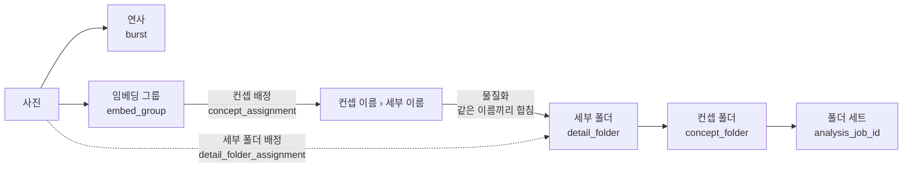

# 용어집

AI 저장소(`organic-agent-ai`)와 서버(`organic-agent-server/wes`)가 **같은 개념을 같은 이름으로** 부르기 위한 정본이다.
두 저장소의 코드·DB·Lambda 페이로드·웹 API·문서는 이 페이지의 이름을 따른다. 새 개념은 코드보다 이 페이지에 먼저 추가한다.

{: .highlight }
2026-09-27 확정. 아래 표의 **목표 이름**이 기준이다. **옛 이름** 열은 아직 코드·DB에 남아 있는 이름으로, 이관이 끝나면 지운다.
이관 순서는 코드 이름 → DB 컬럼(분석을 멈추고 두 저장소를 한 번에 배포) → 페이로드·Bedrock 프롬프트 → 웹 API다.

## 규칙

1. **개념 하나에 이름 하나.** AI 코드, DB 테이블·컬럼·jsonb 키, 서버의 도메인·클래스·필드·함수, Lambda 페이로드, 설정 키, 한국어 문서가 같은 이름을 쓴다.
2. **표기만 언어를 따른다.** `snake_case`(Python·DB·jsonb) ↔ `camelCase`(Kotlin 필드·JSON) ↔ `PascalCase`(클래스). 예: `burst_id` = `burstId`. 이 대응 말고는 글자가 같아야 한다.
3. **경계 예외가 없다.** DB 컬럼, 프롬프트 키, jsonb 키도 같은 이름을 쓴다.
4. **한국어도 하나.** 한국어 용어 하나가 영어 용어 하나와 짝이다.
5. **뜻이 둘인 단어는 쓰지 않는다.** [금지어](#금지어)를 코드 식별자에 쓰지 않는다.

## 한눈에

- 연사와 임베딩 그룹은 **따로 계산한다.** 포함 관계가 아니다.
- 임베딩 그룹과 세부 폴더는 **N:1**이다. VLM이 이름을 붙이지 않은 그룹은 가장 가까운 그룹의 이름을 물려받고(`nearest`), 이름이 같은 그룹은 한 세부 폴더로 합쳐진다.
- 사진은 **세부 폴더에만** 배정된다(세부 폴더 배정). 컨셉 폴더에 직접 든 사진은 없다.
- 임베딩 그룹은 **AI가 계산한 단위**, 세부 폴더는 **제품이 저장하고 사용자가 고치는 단위**다. 둘을 잇는 것이 컨셉 배정이다.

## 사진 한 장의 분석

| 한국어 | 목표 이름 | 정의 | 옛 이름 |
|:---|:---|:---|:---|
| 사진 분석 | `photo_analysis` · `PhotoAnalysis` | 사진 한 장에 대해 AI가 남긴 값의 행 | — |
| 임베딩 | `embedding` | DINOv3 벡터(768차원) | — |
| CLIP 임베딩 | `clip_embedding` | CLIP 벡터(768차원) | — |
| 임베딩 모델 | `embedding_model` | 임베딩을 만든 모델 id | AI embedder 설정 `model_id` |
| 파이프라인 버전 | `pipeline_version` | score·categorize 계산 방식의 버전 문자열. 모델 id가 아니다 | `photo_analysis.model_version`, `modelVersion` |
| 피사체 | `subjects` | 사진의 인물 구성. 값은 `bride`·`groom`·`couple`·`group`·`unknown` | — |
| 백분위 | `technical_pct` · `aesthetic_pct` · `sharpness_pct` | 갤러리 안에서의 순위(0~1) | — |
| 세부 점수 | `sub_scores` | 점수 계산 재료를 담은 jsonb | 키 `clip_parent` → `clip_concept_name` |

## 묶음

| 한국어 | 목표 이름 | 정의 | 옛 이름 |
|:---|:---|:---|:---|
| **연사** | `burst_id` · `burst_rank` · `burstId` | 같은 카메라에서 거의 같은 순간 연속으로 찍힌 사진 묶음 | DB `cluster_id`·`cluster_rank`, AI 결과 키 `clusters`, preference `cluster_size_rel`·`recall_cluster`, 서버 `clusterId`·`byCluster`·`bestPerCluster` |
| 연사 대표 | `burst_rank = 0` | 연사에서 먼저 보여 주는 한 장 | "대표"(그룹 대표 사진과 혼용) |
| **임베딩 그룹** (줄여서 그룹) | `embed_group_id` · `embedGroupId` | 같은 배경·같은 컨셉으로 AI가 묶은 사진 덩어리. 컨셉 배정이 붙는 단위 | AI `gid`·`_Group`·Bedrock `group_id`·결과 `groups`, preference "컨셉 그룹", 서버 KDoc "클러스터", 학습 문서 "세트" |
| 그룹 대표 사진 | `embed_group_sample` | naming이 VLM에 보여 주는 그룹의 사진 | AI `rep_row`·`far_row` |

## 이름표와 폴더

| 한국어 | 목표 이름 | 정의 | 옛 이름 |
|:---|:---|:---|:---|
| **컨셉 배정** | `concept_assignments` · `ConceptAssignment` | 임베딩 그룹 하나에 붙은 "컨셉 › 세부" 이름표. 폴더가 아니라 **임베딩 그룹에 붙는 이름표**다(컨셉 폴더에 배정한다는 뜻이 아니다) | 테이블 `ai_concept_assignments`, 서버 `AiConceptAssignment`·`GroupAssignmentDto` |
| 컨셉 이름 | `concept_name` | 1층 이름 | DB `parent_name`, 서버 `VirtualFolder.parentName`, 추천 breakdown `parent`, score `PARENTS`·`ParentTagger`, Bedrock `parent` |
| 세부 이름 | `detail_name` | 2층 이름 | **DB `concept_name`**, Bedrock `concept`, 프롬프트 "촬영 세트" |
| 제안 컨셉 이름 | `proposed_concept_name` | 컨셉이 기타일 때 VLM이 제안한 이름 | DB `proposed_parent`, AI `proposed_concept` |
| CLIP 컨셉 이름 | `clip_concept_name` | CLIP 다수결로 고른 컨셉 | DB `clip_parent`, AI `clip_concept` |
| 배정 방법 | `assigned_by` = `vlm` \| `nearest` | VLM이 이름을 붙였나, 가장 가까운 그룹에서 물려받았나 | — |
| 배정 확신도 | `confidence` | `vlm`이면 VLM의 자기 평가, `nearest`면 `1 - 그룹 중심 거리`. 두 값을 섞어 비교하지 않는다 | — |
| 검토 필요 | `needs_review` | AI가 자신 없다고 표시한 배정 | — |
| **기타** | `ETC` = "기타" | 이름표가 없거나 고정 목록 밖인 컨셉·세부 이름 | — |
| **컨셉 폴더** | `concept_folders` · `ConceptFolder` | 1층 폴더 | — |
| **세부 폴더** | `detail_folders` · `DetailFolder` | 2층 폴더 | — |
| **세부 폴더 배정** | `detail_folder_assignments` · `DetailFolderAssignment` | 사진 한 장이 든 세부 폴더. 사진은 **세부 폴더에만** 배정되고, 컨셉 폴더는 세부 폴더를 거쳐서만 사진을 가진다. 사진 하나에 배정은 최대 하나 | DB `photo_category_assignments`, 서버 `PhotoFolderAssignment`, API `/category-assignments/move`, admin `PHOTO_CATEGORY_ASSIGNMENT`·스냅샷 키 `categoryAssignments` |
| **컷 종류** | `cut_type` · `CutType` | 세부 폴더 사진의 피사체 다수결(과반일 때만). 라벨: 신부 · 신랑 · 두 분 · 단체 | DB `detail_folders.category`, API 응답 `category`, 추천 라벨 "신부 단독"·"신랑 단독" |
| **폴더 세트** | 키 `analysis_job_id` | 분석 잡 하나가 만든 폴더 전체 | DB `ai_selection_jobs.folder_set_job_id`, API 응답 `folderSetJobId`, 문서 "AI 카테고리 세트" |
| **물질화** | `materialize` | 최신 컨셉 배정으로 폴더 세트를 만드는 일 | "실체화" |
| **폴더 확정** | `confirm` | 부부가 폴더 구조를 확정하고 사진 셀렉으로 넘어가는 한 번의 전이 | API `/folders/from-clusters` → `/folders/confirm` |
| **미분류** | `unfiled` | 어느 세부 폴더에도 들지 않은 사진. 기타와 다르다 | — |

## 파이프라인

| 한국어 | 목표 이름 | 정의 | 옛 이름 |
|:---|:---|:---|:---|
| 분석 잡 | `analysis_jobs` · `AnalysisJob` | 갤러리 하나의 분석 한 번. 상태 `ANALYZING` → `CATEGORIZING` → `DONE` \| `FAILED` | 테이블 `ai_analysis_jobs` |
| 단계 | `embedder` · `score` · `categorize` | AI 모듈 이름 = Lambda 함수 이름 = 서버의 단계 이름 | 서버 `StageCallDto.Embed` |
| embedder 단계 | `embedder` | 미리보기·DINOv3 임베딩·EXIF | — |
| score 단계 | `score` | CLIP 임베딩·미학·기술 점수·피사체 | — |
| categorize 단계 | `categorize` | 백분위·연사·임베딩 그룹을 계산하고 naming으로 컨셉 배정을 만든다 | "카테고리화", "naming 잡" |
| naming | `naming` | categorize 단계 안에서 그룹에 이름표를 붙이는 하위 단계(Bedrock) | — |
| 분석 잡 id | `analysis_job_id` · `analysisJobId` | 페이로드에서 분석 잡을 가리키는 키 | 페이로드 `jobId`(categorize) |
| 처리 잡 id | `processing_job_id` · `processingJobId` | 관리자 재처리 잡을 가리키는 키 | 페이로드 `jobId`(embedder admin) |

## 선호·추천

| 한국어 | 목표 이름 | 정의 | 옛 이름 |
|:---|:---|:---|:---|
| 선호 모델 | `preference_models` · `PreferenceModel` | 마감된 갤러리의 셀렉으로 학습한 선호 가중치 | — |
| 선호 모델 버전 | `model_version` (선호 모델 안에서만) | 선호 모델 자신의 버전 | — |
| 특징 명세 | `feature_spec` | 선호 모델 입력 특징의 이름·순서 버전 | — |

## 금지어

코드 식별자(변수·필드·함수·클래스·컬럼·키)에 쓰지 않는다. 문장 설명은 괜찮다.

| 금지어 | 대신 | 예외 |
|:---|:---|:---|
| `cluster` (명사) | `burst`, `embed_group` | 알고리즘 설명("계층 군집"), 라이브러리 API |
| `parent` (폴더 층의 뜻) | `concept` | admin 휴지통 `parent_type`, `path.parent` 같은 표준 API |
| `category` (명사) | `cut_type`, `detail_folder`, `concept` | 단계 이름 `categorize`와 상태 `CATEGORIZING` |
| `set` · 세트 (그룹의 뜻) | `embed_group` | 폴더 세트 |
| `group` · `gid` (단독) | `embed_group` | 피사체 값 `group`(단체) — AI가 쓰는 데이터 값 |
| 실체화, 카테고리화, 컨셉 그룹, 클러스터(그룹의 뜻) | 물질화, categorize, 임베딩 그룹 | — |

## 결정 기록

| # | 결정 | 이유 |
|:---|:---|:---|
| D1 | 웹 API 계약까지 바꾼다. 마지막 단계에서 웹 PR과 함께, 옛 경로는 한 릴리스 동안 별칭으로 둔다 | 규칙 1 |
| D2 | 단계 이름 `categorize`와 상태 `CATEGORIZING`은 유지한다. 명사 `category`만 금지한다 | Lambda 함수·인프라·웹 계약까지 번지는 비용에 비해 얻는 것이 작다 |
| D3 | `photo_analysis.model_version` → `pipeline_version` | 모델 id로 오해된다. 선호 모델의 `model_version`은 그대로 |
| D4 | `Ai` 접두사를 뺀다: `ConceptAssignment`·`concept_assignments`, `AnalysisJob`·`analysis_jobs` | 출처 표시는 개념이 아니다 |
| D5 | 컷 종류 라벨은 신부 · 신랑 · 두 분 · 단체 | 한국어 하나 |
| D6 | 용어집 정본은 이 페이지 하나다. 각 저장소에 사본을 두지 않는다 | 두 벌은 어긋난다 |
| D7 | `confidence`는 컬럼을 나누지 않고 정의만 적는다 | 아직 이 값을 쓰는 곳이 없다 |
| D8 | `/folders/from-clusters` → `/folders/confirm` | `cluster`가 금지어이고, 하는 일은 확정이다 |
| D9 | 사진의 폴더 배정은 `detail_folder_assignments` · `DetailFolderAssignment`(세부 폴더 배정). API `/detail-folder-assignments/move`, admin `DETAIL_FOLDER_ASSIGNMENT` | 사진은 세부 폴더에만 배정된다. 배정 이름은 배정되는 것을 담는다(컨셉 배정 = 그룹에 컨셉 이름, 세부 폴더 배정 = 사진에 세부 폴더) |
