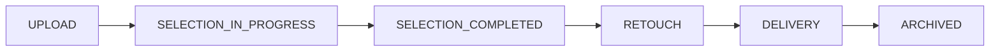

# 사용자 흐름

{: .note }
2026-09-05 확정 정책과 Server V6 기준이다. 현재 Web에는 이전 계약·로컬 상태가 남아 있으므로 화면 연동 완료 여부는 [구현 기준과 확인 상태](../implementation-status.md)와 [프론트엔드](../tech/web.md)를 따로 확인한다.

현재 서버가 제공하는 역할별 흐름이다. Web 화면이 이 흐름 전체를 구현한 상태는 아니다.

## STUDIO OWNER

1. 로그인 후 PERSONAL과 참여 중인 STUDIO 작업공간을 조회한다.
2. STUDIO를 선택해 갤러리를 만들고 사진을 업로드한다.
3. 구성원을 조회하고 OWNER를 승격·강등한다. 마지막 OWNER는 제거하지 못한다.
4. 외부 AI 작업 상태와 사진별 카테고리 결과를 확인하고 컨셉·세부 폴더를 편집한다.
5. 고객을 갤러리에 초대하고 셀렉·협업·보정 진행 상태를 조회한다.
6. 제출된 보정 요청의 결과를 업로드하고 회차를 완료한다. 납품 시각·메모 기록은 관리자 운영 경로를 사용한다.

## STUDIO MEMBER

1. 참여 중인 작업공간과 갤러리를 운영한다.
2. 사진 업로드와 카테고리를 관리한다.
3. 셀렉·별점·협업 반응을 조회하지만 고객 측 결과는 편집하지 않는다.
4. 보정 결과를 업로드하고 회차를 완료한다. 납품 기록은 관리자 운영 경로에서 처리한다.

## PERSONAL OWNER와 GALLERY MEMBER

1. 자신의 PERSONAL 작업공간 또는 초대받은 갤러리에 들어간다. PERSONAL OWNER는 사진 업로드·카테고리 관리도 수행한다.
2. 카테고리와 미분류 사진을 탐색한다.
3. 공동 셀렉과 별점을 편집하고 필요하면 AI 추천 초안을 검토한다.
4. 컨셉 범위의 협업 링크를 만들고 사용자·게스트 반응을 참고한다.
5. 셀렉을 제출하고 보정 요청과 사진 주석을 작성한다.
6. STUDIO 갤러리에서는 스튜디오가 올린 결과를 확인한다. PERSONAL 갤러리의 OWNER에게 스튜디오 결과 처리 권한을 부여하지 않는다.

## 공유 링크 참여자

1. 로그인 사용자는 Bearer 신원으로, 비로그인 사용자는 닉네임과 게스트 토큰으로 참여한다.
2. 공유된 컨셉의 현재 사진만 조회한다.
3. 허용된 참여자는 사진별 좋아요와 댓글을 작성·관리한다.

## 최고 관리자

1. Tailnet 443에서 BackOffice에 접속하고 별도 관리자 세션으로 인증한다.
2. 사용자·작업공간·갤러리·사진·카테고리·셀렉·협업·보정을 조회한다.
3. 사유, 멱등 키와 예상 버전을 포함해 변경한다.
4. 휴지통·재처리·감사·알림으로 결과를 추적한다.

## 상태 흐름

공개 상태 `DRAFT | OPEN | CLOSED`, 업무 상태 `DRAFT | IN_PROGRESS | COMPLETED | ARCHIVED`, 위 화면 단계는 별도 축이다. 그림은 업무 순서를 요약하며 각 단계가 자동 전환됨을 뜻하지 않는다. 목록의 화면 단계 필터는 `?stage=`다.

{: .warning }
PERSONAL 권한은 정책과 구현에 차이가 있다. 현재 서버는 초대된 PERSONAL MEMBER도 관리·고객 편집 권한으로 통과시킨다. 위 OWNER 중심 정책을 실제 접근 제한으로 단정하지 않는다. [확인한 구현 차이](../implementation-status.md)를 따른다.
