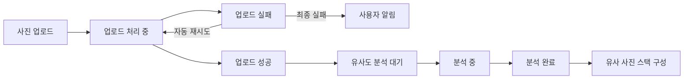
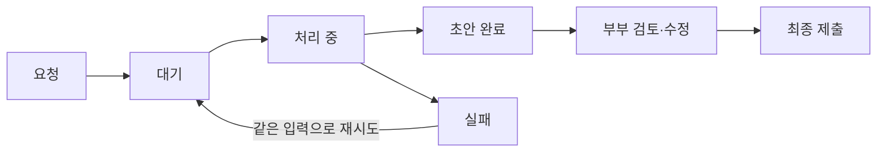

# 사용자 흐름

세 역할의 여정과, 제품을 관통하는 두 개의 상태 체인입니다. 화면 단위의 전체 정보 구조는 [아키텍처 — Information](../architecture/information.md)에 있습니다.

## 사진작가 / 스튜디오 운영자

1. 랜딩 페이지에서 카카오·구글·네이버 OAuth로 로그인하거나 처음 가입
2. `PHOTOGRAPHER` 역할로 진입해 소속 스튜디오를 선택하거나 새 작업공간 생성
3. 생성·진행·완료·보관 상태별 갤러리 목록 확인
4. 필요 시 앨범 템플릿 제작 (규격 · 표지 · 2D 펼침면 · 프레임 레이아웃)
5. 갤러리 생성 — 이름, 완료 예정일, 목표 선택 장수, 적용 템플릿 설정
6. 사진 업로드, 업로드·유사도 분석 상태 확인
7. 부부 초대 링크 발급·복사·전달
8. 셀렉 진행 상태, 최종 선택 사진과 제출된 목업 확인
9. 부부가 제출하거나 조기 마감하면 완료 알림 확인
10. 보정 가능/불가능 방식을 등록하고, 부부가 동의한 구조화된 보정 요청 수신

## 부부

1. 초대 링크를 열고 각자 자신의 계정으로 로그인하거나 `CLIENT`로 가입
2. 동일한 갤러리에 참여 (부부는 정확히 2명)
3. 사진 그리드 · 싱글뷰 · 비교 셀렉으로 탐색
4. **5틱 유사도 슬라이더**로 유사 사진 스택을 재구성하고 필요한 묶음을 폴더로 고정
5. 폴더 이름·자식 폴더를 관리하고 같은 부모 안에서 사진 이동
6. 현재/목표 선택 장수를 보며 직접 선택·해제
7. 필요 시 **AI 1차 셀렉** 실행 → 초안 검토 → 추가·해제·교체
8. 협업 폴더를 만들어 공유 URL + 접속 토큰 발급, 게스트 반응을 참고
9. 앨범 목업에서 사진 순서와 크롭 영역 수정
10. 최종 제출 또는 조기 마감 → 이후 읽기 전용 재열람
11. 필요 시 보정 요청 입력 → AI 정리안 동의 → 작가에게 전달

## 게스트

1. 메신저로 공유 URL과 접속 토큰 수신
2. 회원가입·로그인 없이 접속해 토큰 입력
3. 닉네임 설정 후 공유 허용된 사진만 열람
4. 사진별 좋아요와 댓글 작성
5. 같은 협업 폴더의 다른 게스트 반응도 확인

## 상태 체인 1 — 업로드와 분석

사진 한 장이 업로드부터 스택 구성까지 거치는 상태입니다.

- 대상 형식은 `jpg` `jpeg` `png` `raw` `heic` — 브라우저가 직접 그리지 못하는 RAW·HEIC는 별도 고화질 표시용 변환본을 만들고, **다운로드는 항상 원본**을 제공합니다.
- 이 체인의 기술 구현은 [AI 파이프라인](../tech/ai-pipeline.md)에 있습니다.

## 상태 체인 2 — AI 1차 셀렉

- 실행 조건: 유사도 분석 완료 + 마감 전 + 수동 선택이 목표 장수 미만
- 같은 갤러리에서는 **한 번에 하나의 AI 셀렉 작업**만 실행합니다.
- 완료된 초안은 임의로 재생성하지 않고, 사용자가 편집한 결과를 자동으로 다시 채우지 않습니다.
