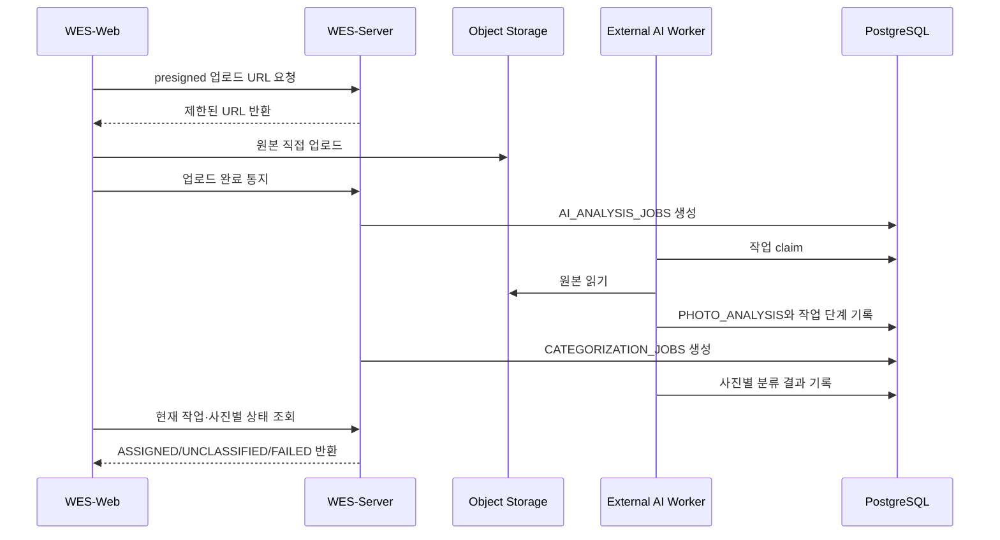

# AI 파이프라인 — 제품 계약과 외부 워커

AI 모델은 제품 서버 안에서 실행하지 않는다. WES-Server는 작업과 결과의 데이터 계약을 소유하고 외부 워커가 모델을 실행한다.

## 전체 경계

## 서버가 소유하는 계약

- `AI_ANALYSIS_JOBS`는 분석 작업의 모드와 단계를 추적한다.
- `PHOTO_ANALYSIS`는 임베딩·기술 품질·모델 버전과 분석 시각을 저장한다.
- `CATEGORIZATION_JOBS`는 초기·증분 분류 작업을 추적한다.
- `CATEGORIZATION_JOB_PHOTOS`는 사진별 `PENDING | ASSIGNED | UNCLASSIFIED | FAILED`와 실패 코드를 저장한다.
- `AI_SELECTION_JOBS`, 추천과 비교 판정은 수정 가능한 셀렉 초안을 저장한다.

모든 결과는 갤러리 귀속을 검증한다. 모델 출력이 다른 갤러리의 사진·폴더·셀렉을 참조하면 복합 FK가 거부한다.

## 외부 워커가 소유하는 책임

- 모델과 런타임 의존성
- 작업 claim, 재시도와 부분 실패 처리
- 객체 저장소에서 원본 읽기와 파생 결과 생성
- 모델 버전과 재현 가능한 결과 메타데이터 기록

외부 워커의 저장소·배포 SHA는 이 문서에서 임의로 추정하지 않는다. 이 저장소는 서버 경계와 DB 계약만 `구현 완료`로 표시한다.

## 제거한 현재 계약

`photo-clusters`, 5단계 유사도 슬라이더와 서버 `cluster`/`embedding` 도메인은 현재 제품 계약이 아니다. 해당 구현과 수치는 [ADR-003](../decisions/adr-003-category-to-similarity.md), [ADR-004](../decisions/adr-004-pgvector-union-find.md), [ADR-007](../decisions/adr-007-embedder-single-job.md)에 역사 기록으로 남긴다.

현재 ERD는 [사진·AI 분석·카테고리](../data-model/photo-ai-category.md)와 [셀렉션·추천](../data-model/selection-recommendation.md)를 따른다.
