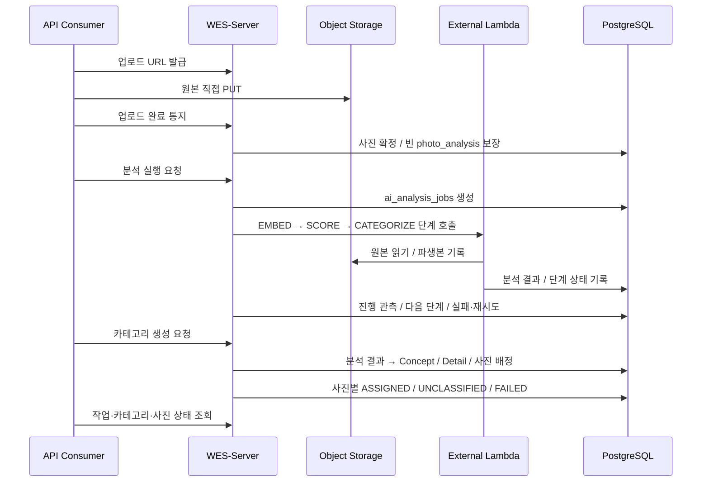

# AI 파이프라인 — 서버 조정과 외부 모델 실행

모델은 외부 AI 워커에서 실행하고 제품 서버가 단계 호출·진행 관측·재시도를 조정한다. 카테고리 생성은 분석 결과를 읽는 서버 작업이다.

## 현재 처리 흐름

업로드 완료 자체가 전체 분석 실행은 아니다. `AnalysisService`의 실행 요청이 작업을 만들고 `AnalysisOrchestrator`가 커밋 뒤 외부 실행기를 호출한다. Web의 현재 연동 범위는 [프론트엔드](web.md)에서 구분한다.

---

## 분석 작업과 상태

- `mode=FULL` : `EMBED → SCORE → CATEGORIZE` 순서다.
- `mode=NAMING` : 기존 분석 위에서 `CATEGORIZE`만 실행한다.
- `status` : 작업 전체의 `PENDING | RUNNING | DONE | FAILED`다.
- `stage`, `stage_status` : 현재 단계와 단계별 진행 상태다. 갤러리의 화면 `stage`와 다른 필드다.
- EMBED는 서버가 `photo_analysis` 진행을 관측한다. SCORE/CATEGORIZE는 외부 실행기의 단계 상태·heartbeat를 반영한다.
- 호출 실패·정체는 서버 스윕과 시도 횟수로 재처리하며, 한도를 넘기면 실패로 마감한다.

`PHOTO_ANALYSIS`의 SCORE 결과와 CATEGORIZE 결과는 별도 CHECK를 적용한다. `model_version`이 채워졌다고 전체 분석이 끝난 것은 아니다.

---

## 카테고리와 셀렉

`AiCategoryFolderService`는 분석 결과·컨셉 제안에서 `컨셉 → 세부 → 사진 배정`을 생성한다. `CATEGORIZATION_JOBS`의 전체 상태는 `RUNNING | SUCCEEDED | FAILED`, 사진별 상태는 `PENDING | ASSIGNED | UNCLASSIFIED | FAILED`다. 사진별 결과는 서버가 기록한다.

카테고리·사진별 작업·셀렉 항목의 교차 갤러리 연결은 V6 복합 FK가 거부한다. 추천과 비교 판정의 모든 사진 참조까지 복합 FK로 보호되는 것은 아니다. → [사진·AI 분석·카테고리](../data-model/photo-ai-category.md), [셀렉션·추천](../data-model/selection-recommendation.md)

---

## 분석 데이터와 검증 범위

`photo_analysis.cluster_id`, `cluster_rank`, `embed_group_id`는 점수·그룹 분석의 내부 메타데이터다. 카테고리의 컨셉·세부 폴더 식별자와 구분한다.

기준은 Server `bc8948a`다. 외부 워커 배포 SHA·파생본 규격·모델 성능은 별도 확인 대상이다.
