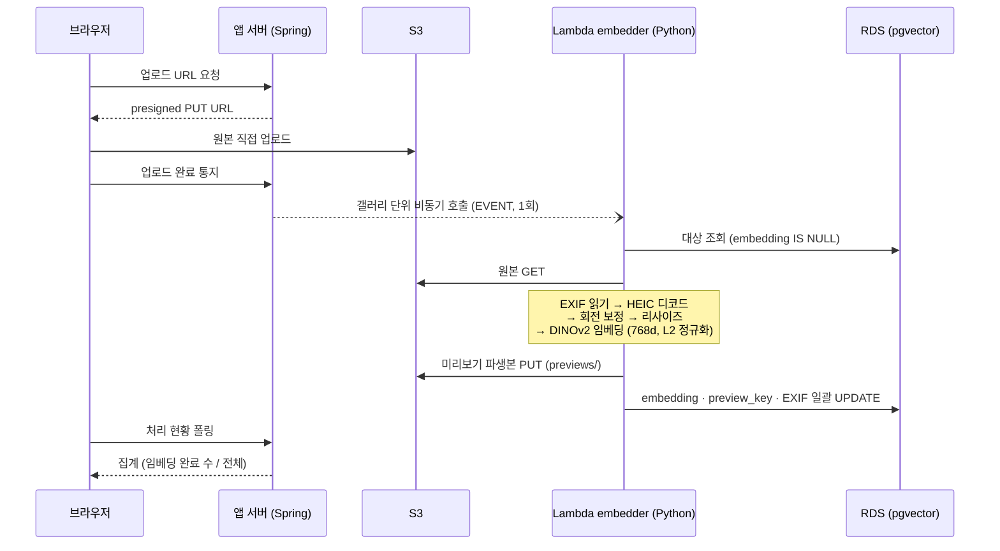

# AI 파이프라인 — 임베딩과 클러스터링

사진이 업로드된 뒤 "유사 사진 스택"이 되기까지의 전체 파이프라인입니다.

## 전체 흐름

핵심은 호출 단위입니다 — **사진당 호출이 아니라 갤러리당 1회** 비동기(EVENT) 호출이고, Lambda가 남은 대상을 스스로 찾아 처리합니다.

## embedder의 설계 원칙

Lambda로 배포되지만 로컬 CLI로도 같은 코드가 그대로 돕니다 (진입점만 다름).

- **재실행이 안전하다.** 기본 조건이 `embedding IS NULL`이라 중간에 죽어도 다시 부르면 남은 것만 이어서 합니다. 한 장이 실패해도 잡을 죽이지 않고 실패 키만 모아 반환합니다.
- **미리보기 파생본도 여기서 만든다.** 임베딩을 하려면 어차피 HEIC 디코드·EXIF 회전·리사이즈를 해야 하고, 그 결과가 그대로 브라우저가 그릴 수 있는 이미지입니다. 별도 잡으로 빼면 같은 이미지를 두 번 받아 두 번 디코딩하게 됩니다. 아이폰 원본(HEIC)은 주요 브라우저가 그리지 못하므로 이 파생본이 미리보기의 유일한 통로입니다. → [ADR-007](../decisions/adr-007-embedder-single-job.md)
- **EXIF도 여기서 읽는다.** 앱 서버는 이미지 바이트를 만지지 않아 EXIF를 읽을 방법이 없고, 이 잡은 이미 원본을 열어 두었습니다. 회전·축소 **전의** 원본에서 읽습니다 (변환 후에는 Orientation 태그가 지워지고 크기도 원본이 아니므로).
- **부분 실패가 전체를 죽이지 않는다.** 파생본 생성 실패, EXIF 추출 실패는 각각 별도 실패 목록(`previewsFailed`, `metadataFailed`)으로 격리되고 임베딩 자체는 적재됩니다. 실패 배열이 비어 있지 않으면 임베딩이 아니라 권한을 봐야 한다는 운영 신호가 됩니다.
- **`PENDING`은 건너뛴다.** 업로드 URL만 발급되고 S3에 객체가 없을 수 있는 상태이기 때문입니다.

## 파라미터

| 파라미터 | 값 | 의미 |
|:---|:---|:---|
| 모델 | `facebook/dinov2-base` | 이미지를 라벨 없이 비교 가능한 벡터로 만드는 self-supervised 비전 모델 |
| `EMBED_DIM` | 768 | `vector(768)` 컬럼 · 엔티티 상수 · 인프라까지 **세 곳이 일치**해야 하는 값 |
| `EMBED_BATCH_SIZE` | 8 | 모델에 한 번에 넣는 장수 |
| `RESIZE_LONG_EDGE` | 1024 | 디코딩 직후 메모리 제어 겸 파생본 크기 |
| `PREVIEW_QUALITY` | 82 | 파생본 JPEG 품질 — 1024px에서 장당 약 200KB |

## 클러스터링 — 유사도에서 스택으로

임베딩이 쌓이면 서버의 `cluster` 도메인이 스택을 만듭니다.

1. **pgvector 코사인 유사도**로 임계값 이상의 사진 쌍을 조회
2. 쌍들을 **Union-Find 연결 요소**로 묶어 스택 구성
3. 사용자에게는 **레벨 프리셋(1~5)** — 제품의 5틱 유사도 슬라이더와 1:1 대응

정밀도를 위한 장치 두 가지가 더 있습니다:

- **시간 조건부 이중 임계값** — 촬영 시각이 가까운 쌍(연속 촬영)에는 관대한 임계값을, 먼 쌍에는 엄격한 임계값을 적용합니다. EXIF 촬영 시각을 embedder가 추출해 두는 이유 중 하나입니다.
- **상호 kNN 필터** — 서로가 서로의 최근접 이웃일 때만 쌍으로 인정해, 대형 스택이 엉뚱한 사진을 끌어들이는 것을 막습니다.

벡터 저장소를 별도 인프라 없이 RDS 확장으로 해결한 배경은 [ADR-004](../decisions/adr-004-pgvector-union-find.md)에 있습니다.

## 다음 단계 — photoselect 모듈

지금의 파이프라인이 "비슷한 사진 묶기"라면, 진행 중인 **photoselect 모듈**은 "잘 나온 사진 고르기"입니다 — 기술 품질 점수 파이프라인(배치) + 목표 장수까지 채우는 추천 + 사진 진단 API. LLM은 근거 문장화 같은 소규모 호출만 쓰고 최종 결정은 사람에게 남긴다는 경계는 그대로 유지됩니다. 마일스톤(M1 기반 → M2 코어 → M3 제공)은 [스프린트](../sprints/index.md)에서 추적합니다.
