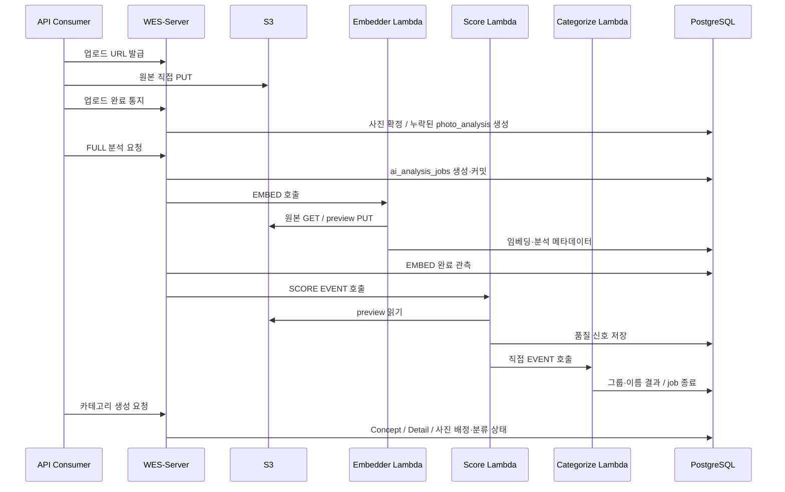

# AI 파이프라인 — 서버 조정과 외부 모델 실행

서버가 분석 요청과 DB 계약을 관리하고 WES-AI의 Lambda 3개가 모델을 실행한다. 현재 Score → Categorize 직접 호출 방식과, 서버에 준비된 단계 보고 방식을 구분한다.

## 현재 원격 소스의 처리 흐름

기준은 Server `bc8948a`, AI `d256875`이며 서버의 `lambda-reports-stage` 기본값은 `false`다.

업로드 완료는 전체 분석을 실행하지 않는다. `completeUpload`는 누락된 `PhotoAnalysis` 행만 만들고 기존 AI 결과·임베딩을 보존한다. `AnalysisService`의 명시적 요청이 작업을 만들며 `AnalysisOrchestrator`가 커밋 뒤 실행기를 호출한다. `NAMING`은 기존 분석을 사용해 Categorize만 직접 호출한다.

---

## 실행기별 책임

| 실행기 | 현재 소스의 책임 |
|:---|:---|
| Embedder | 원본 읽기, EXIF·preview 생성, DINOv3 임베딩 |
| Score | preview에서 CLIP·ARNIQA·LAION 품질 신호 생성, Categorize 직접 EVENT 호출 |
| Categorize | NumPy 기반 그룹화, Bedrock 컨셉 이름·배정 결과, 작업 종료 |
| 서버 | 분석 요청·EMBED 관측, DB 계약, 카테고리 반영, Kotlin 추천·비교와 Bedrock 호출 |

임베딩·품질·분류 출력은 공유 PostgreSQL에 저장한다. preview는 S3에 기록하며 스키마 변경은 Server Flyway가 소유한다. 추천 후보는 사용자가 수락·수정하며 분석 Lambda가 셀렉을 자동 제출하지 않는다.

---

## 단계 계약과 현재 한계

| 구분 | `false` — 현재 기본 계약 | `true` — 서버에 준비된 계약 |
|:---|:---|:---|
| SCORE 이후 호출 | 서버가 한 번 보내고 Score가 Categorize를 호출 | 서버가 SCORE·CATEGORIZE를 각각 호출 |
| 완료 기록 | 외부 실행기가 job `DONE/FAILED`를 기록 | 단계 보고를 바탕으로 서버가 전이·종료 |
| 단계 상태·heartbeat | AI main은 `stage_status`·heartbeat를 쓰지 않음 | 워커가 단계 점유·완료·heartbeat를 기록해야 함 |
| 재전송·정체 감지 | SCORE/CATEGORIZE 전달 후 단계 재전송·heartbeat 정체 감지 없음 | 단계 보고와 시간·시도 횟수로 재처리 |

`status`는 전체 작업의 `PENDING/RUNNING/DONE/FAILED`, `stage`는 분석 단계이며 갤러리 화면의 진행 단계와 다른 필드다. 호출 자체의 실패 처리와 EMBED 진행 관측은 서버에 구현되어 있다. 이를 현재 워커의 SCORE/CATEGORIZE 단계 보고까지 완료됐다는 뜻으로 확대하지 않는다.

---

## 카테고리와 셀렉

`AiCategoryFolderService`는 분석 결과에서 `ConceptFolder → DetailFolder → PhotoCategoryAssignment`를 만든다. INITIAL은 전체, INCREMENTAL은 미처리 사진을 대상으로 하며 수동 이동·수동 미분류를 보존한다. 분류 작업 전체 상태는 `RUNNING/SUCCEEDED/FAILED`, 사진별 상태는 `PENDING/ASSIGNED/UNCLASSIFIED/FAILED`다.

`photo_analysis.cluster_id`, `cluster_rank`, `embed_group_id`는 AI 내부 출력이며 제품 카테고리 식별자가 아니다. 폐기된 cluster API를 복원하지 않는다. 카테고리·사진별 작업·셀렉 항목의 교차 갤러리 연결은 V6 복합 FK가 거부한다. 추천·비교 판정의 모든 사진 참조까지 복합 FK로 보호되는 것은 아니다.

---

## 근거와 검증 범위

- [서버 분석 설정](https://github.com/organic-agent/organic-agent-server/blob/bc8948a89d2f2c964753710ab938da3a9af8d15f/src/main/kotlin/com/soma/wes/analysis/config/AnalysisProperties.kt)
- [서버 단계 조정](https://github.com/organic-agent/organic-agent-server/blob/bc8948a89d2f2c964753710ab938da3a9af8d15f/src/main/kotlin/com/soma/wes/analysis/service/AnalysisOrchestrator.kt)
- [Score → Categorize 호출](https://github.com/organic-agent/organic-agent-ai/blob/d256875cf9eb1473481092b8419c58e39f27f332/score/score/chain.py)

원격 소스를 확인한 것이며 운영 워커의 배포 SHA·모델 성능·운영 설정값을 실측한 것은 아니다. [사진·AI·카테고리](../data-model/photo-ai-category.md) · [셀렉션·추천](../data-model/selection-recommendation.md) · [프론트엔드](web.md)
