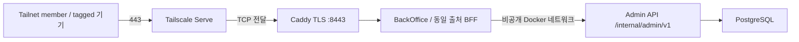

# 백오피스 — 최고 관리자 운영

BackOffice는 [`16b19e8`](https://github.com/organic-agent/organic-agent-backoffice/tree/16b19e8c47e5f958517d478d466cb2a471e127ec) 기준의 Next.js 관리자 UI다. 최고 관리자는 조회·변경·복원·재처리를 수행하고 읽기 전용 대리보기 중에는 쓰기를 차단한다.

## 요청 경계

브라우저는 동일 출처 `/api/admin/*`에 요청한다. Next.js BFF(Backend for Frontend)가 `ADMIN_API_BASE_URL`의 관리자 API를 호출하며 브라우저가 내부 API에 직접 접속하지 않는다. 공개 ALB 경로와 관리자 API 실행 프로세스는 분리한다. Tailnet 443은 Tailscale Serve가 localhost Caddy TLS :8443으로 TCP 전달한다. BFF에는 AWS 자격 증명을 제공하지 않으며 `wes-admin-api:8081`은 Docker 내부에서만 호출한다.

---

## 현재 운영 범위

- 개별 관리자 로그인·최초 비밀번호 변경·계정 잠금과 세션 폐기
- 사용자·작업공간·스튜디오·갤러리·사진·카테고리·분류 작업·별점·셀렉·협업·보정 운영
- 통합 참여자의 `participantId`, USER/GUEST 유형·사용자 ID, 사진별 분류 상태, 셀렉 작성자·정렬 조회
- 사유·멱등 키·예상 버전을 확인한 변경, 7일 연쇄 휴지통과 관계별 복원
- 감사·리비전 비교·복원·원본 교체·처리 재시도·관리자 알림
- 읽기 전용 대리보기와 시스템 설정·기능 플래그 조회

---

## 배포와 검증

서버 공개 API의 Flyway·health 확인 → 관리자 API → BackOffice 순서로 반영한다. BackOffice는 전용 OIDC 역할과 SSM으로 컨테이너를 교체하고 버전·health·미인증 관리자 세션 `401`·Caddy 경유 경로를 검사한다.

현재 병합 SHA와 당시 테스트·배포 기록은 [구현 기준과 확인 상태](../implementation-status.md)에 있다. Tailnet 네트워크 접근 허용과 관리자 로그인 권한은 별도다.
