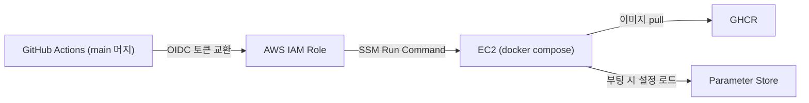

# 인프라와 배포

전체 토폴로지 그림은 [아키텍처 — Infrastructure](../architecture/infrastructure.md)에 있다. 이 페이지는 구현과 운영 기록이다.

## Terraform 구조

| 구성 | 내용 |
|:---|:---|
| 스택 | `dns`(Route 53 존 — 최초 1회) + 앱 스택(나머지 전부) 분리. 앱을 destroy해도 NS 위임 유지 |
| 모듈 | `admin-access`, `analysis`, `compute`, `database`, `github-actions`, `ingress`, `monitoring`, `network`, `security`, `storage` — 10개 |
| State | 사전 생성 S3 backend, app/dns 키 분리, S3 native lock |
| 비밀값 | DB 비밀번호는 write-only 인자(`ephemeral` → `password_wo`)로 전달 → **state에 평문이 남지 않는다** |

---

## 키 없는 배포 파이프라인

배포 경로 어디에도 장기 자격증명이 없다.



- GitHub Actions는 저장된 액세스 키 대신 **OIDC로 단기 자격증명을 교환**한다.
- 서버 접근은 SSH 대신 **SSM Run Command** — 22번 포트를 열지 않는다.
- 시크릿은 전부 Parameter Store에 있고 EC2가 부팅 시 읽는다. → [ADR-006](../decisions/adr-006-keyless-deploy.md)

AI 실행 코드는 제품 서버와 **배포 경로가 다르다.** `analysis` 모듈은 외부 워커가 사용할 인프라 경계를 관리하고 모델 코드는 별도 저장소가 배포한다. 제품 API 배포는 AI 모델 릴리스를 암묵적으로 갱신하지 않는다.

## 공개·관리자 네트워크 분리

공개 사용자 요청은 ALB를 거친다. BackOffice와 `/internal/admin/v1`은 공개 ALB에 노출하지 않고 Tailnet의 `tag:wes-admin:443`으로만 제공한다.

- 허용 주체: `autogroup:member`, `autogroup:tagged`
- 직접 차단: 22, 8080, 8443
- Tailscale Funnel: 사용하지 않음
- 관리자 보안 그룹 공개 ingress: 0

정책 배경은 [ADR-011](../decisions/adr-011-private-admin-network.md)에 있다.

---

## 제로 상태에서 배포 순서

폐기 후 재구축을 전제로 순서를 문서화해 두었다.

```
[1] dns 스택 (최초 1회)        — Route 53 존 + NS 위임
[2] SSM 수동 파라미터 등록      — DB 비밀번호, OAuth, CORS 등
[3] 앱 스택 terraform apply    — network부터 admin-access까지 10개 모듈
[4] 배포 롤 ARN을 서버 저장소 시크릿에 등록
[5] 서버 저장소 main 머지       — CD가 빌드 → GHCR → SSM 배포
[6] Flyway V1→V6와 Hibernate validate 확인
[7] 외부 AI 워커를 독립 배포하고 작업 계약 확인
[8] 공개 health · 관리자 401 · Tailnet 443 경계 검증
```

---

## 역사적 운영 사건

다음 사건은 2026-08 서버 내 embedder를 운용하던 당시 기록이다. 현재 모델 실행 경계는 외부 AI 워커로 이동했다.

{: .warning }
> **조직 SCP가 RDS IAM 인증을 막다**
>
> embedder의 DB 접속은 **RDS IAM 인증**으로 설계했다 — 15분짜리 토큰을 로컬 서명으로 만들기 때문에 NAT도 엔드포인트도 없는 DB 서브넷에서 비밀번호 없이 접속할 수 있고, 비밀번호가 어디에도 남지 않는다.
>
> 그런데 조직 SCP(Service Control Policy)가 계정 전체에서 `rds-db:connect`를 거부했다. 계정 관리자인데도 막힌다는 것이 곧 멤버 계정이라는 증거였고(SCP는 관리 계정에는 적용되지 않는다), 멤버 계정 안에서는 풀 수 없는 제약이다. 판별은 IAM 정책 시뮬레이터로 했다 — **`MatchedStatements`가 비어 있는데 `explicitDeny`** 라면 계정 내 어떤 정책도 거부하지 않았다는 뜻이므로 거부는 조직에서 온 것이다.
>
> 비밀번호 인증으로 임시 전환하되, 비밀번호를 Terraform이 주입하면 state에 평문이 남으므로 **apply 밖에서 한 번 주입하고 `ignore_changes`로 지키는** 방식을 택했다. SCP가 풀리면 되돌리는 원복 절차까지 런북에 같이 기록했다.

{: .warning }
> **GRANT 누락 — 코드가 배포되는 날 터진다 (2026-08-14)**
>
> embedder의 DB 사용자를 만들 때 `galleries` 테이블 SELECT 권한을 빠뜨렸다. 당시 코드는 그 테이블을 읽지 않아 문제가 없었지만, 휴지통에 들어간 갤러리를 거르는 코드가 배포되자 임베딩이 권한 오류로 전량 실패했다.
>
> ⇒ 권한 누락은 그 권한을 쓰는 코드가 배포되는 날 터진다. 이 교훈을 런북의 사용자 생성 절차(필요 GRANT 목록 포함)로 남겼다.

---

## 의도된 한계

이 인프라는 **폐기 가능한 테스트 환경**이다 — Single-AZ, 백업·스냅샷·삭제 보호·오토스케일링 없음. 목표 아키텍처와의 간극(CDN, 모니터링 대시보드 등)은 [System 아키텍처의 차이 표](../architecture/system.md#목표-설계와-현재-구현의-차이)에서 관리한다.

## 구현 상태

기준 병합 SHA는 `cfbd72e`다. Terraform·Tailscale 정책·draw.io 정적 검증과 PR CI는 통과했다. 기능 Terraform 변경은 없어 별도 apply를 하지 않았고 실제 Tailnet 관리자 화면과 접근 경로의 최종 동일성은 인증 세션 부재로 확인하지 못했다.
