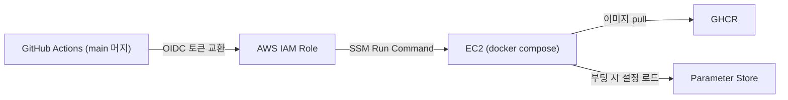

# 인프라와 배포

전체 토폴로지 그림은 [아키텍처 — Infrastructure](../architecture/infrastructure.md)에 있다. 이 페이지는 구현과 운영 기록이다.

## Terraform 구조

| 구성 | 내용 |
|:---|:---|
| 스택 | `dns`(Route 53 존 — 최초 1회) + 앱 스택(나머지 전부) 분리. 앱을 destroy해도 NS 위임 유지 |
| 모듈 | `admin-access`, `analysis`, `compute`, `database`, `github-actions`, `ingress`, `monitoring`, `network`, `security`, `storage` — 10개 |
| State | 사전 생성 S3 backend, app/dns 키 분리, S3 native lock |
| 비밀값 | DB 비밀번호는 write-only 인자(`ephemeral` → `password_wo`)로 전달 → **state에 평문이 남지 않는다** |

---

## 키 없는 배포 파이프라인

GitHub Actions의 AWS 인증은 저장된 액세스 키 대신 OIDC 단기 자격증명을 사용한다. 애플리케이션 시크릿과 관리자 세션은 별도 관리한다.



- GitHub Actions는 저장된 액세스 키 대신 **OIDC로 단기 자격증명을 교환**한다.
- 서버 접근은 SSH 대신 **SSM Run Command** — 22번 포트를 열지 않는다.
- 시크릿은 전부 Parameter Store에 있고 EC2가 부팅 시 읽는다. → [ADR-006](../decisions/adr-006-keyless-deploy.md)

AI 실행 코드는 제품 서버와 **배포 경로가 다르다.** `analysis` 모듈은 외부 워커가 사용할 인프라 경계를 관리하고 모델 코드는 별도 저장소가 배포한다. 제품 API 배포는 AI 모델 릴리스를 암묵적으로 갱신하지 않는다.

## 공개·관리자 네트워크 분리

공개 사용자 요청은 ALB를 거친다. Tailnet의 `tag:wes-admin:443`은 Tailscale Serve가 localhost Caddy TLS :8443으로 TCP 전달하는 BackOffice 진입점이다. 브라우저의 동일 출처 `/api/admin/*`를 Next.js BFF가 받아 비공개 Docker 네트워크의 `/internal/admin/v1`로 전달한다. 관리자 API를 공개 ALB나 Tailnet 443에 직접 노출하지 않는다.

- 허용 주체: `autogroup:member`, `autogroup:tagged`. 네트워크 접근 후 별도 관리자 로그인이 필요하다.
- 직접 차단: 22, 8080, 8443
- Tailscale Funnel: 사용하지 않음
- 관리자 보안 그룹 공개 ingress: 0

정책 배경은 [ADR-011](../decisions/adr-011-private-admin-network.md)에 있다.

---

## AI·스토리지와 내부 접근

S3 원본·preview·retouch는 Presigned PUT/GET으로 접근하며 기본 암호화는 SSE-S3(AES256)다. RDS PostgreSQL/pgvector는 Private Single-AZ이고 공개 API·관리자 API·AI Lambda가 사용한다.

Embedder·Score·Categorize는 DB subnet에 두며 인터넷 경로를 두지 않는다. S3 Gateway와 Lambda·Bedrock Runtime Interface Endpoint로 필요한 AWS API에 접근한다. 현재 서버 기본값과 AI main의 직접 호출 방식은 [AI 파이프라인](ai-pipeline.md)을 따른다.

public/admin/monitoring은 Parameter Store 경로를 분리한다. 공개 API·관리자 API·BackOffice·AI는 전용 OIDC 역할로 배포한다. AI는 ECR/Lambda 경로를 사용하며 같은 호스트의 관리자 API·BackOffice 교체는 배포 잠금으로 겹침을 막는다.

---

## 제로 상태에서 배포 순서

신규 환경을 구성하는 순서다. 기존 환경의 배포에서는 적용된 스키마·데이터를 유지한다.

```
[1] dns 스택 (최초 1회)        — Route 53 존 + NS 위임
[2] SSM 수동 파라미터 등록      — DB 비밀번호, OAuth, CORS 등
[3] 앱 스택 terraform apply    — network부터 admin-access까지 10개 모듈
[4] 배포 롤 ARN을 서버 저장소 시크릿에 등록
[5] 서버 저장소 main 머지       — CD가 빌드 → GHCR → SSM 배포
[6] 공개 API Flyway V1→V6·health 확인 후 관리자 API 배포
[7] 외부 AI 워커를 독립 배포하고 작업 계약 확인
[8] 공개 health · 관리자 401 · Tailnet 443 경계 검증
```

---

## 의도된 한계

기본 인프라는 Single-AZ이며 자동 고가용성·오토스케일링을 구성하지 않는다. 현재 배포에서는 기존 데이터와 적용된 Flyway 이력을 보존한다. 변경 전 수동 복구 스냅샷과 자동 백업 설정은 구분한다. Web은 Vercel, 공개 API는 ALB를 사용한다. 현재 Terraform에는 CloudFront·WAF·EventBridge·Step Functions·AWS Batch·SQS DLQ가 없다. 모니터링 코드는 별도 EC2의 Loki·Grafana/Caddy, Lambda 관측은 CloudWatch다. 이는 소스 구성 확인이며 운영 대시보드 접속 실측과 구분한다.

## 구현 상태

기준 원격 main은 `cfbd72e`다. 정적 검증·PR CI와 apply-app 워크플로가 성공했으며 Terraform 변경은 추가 0·변경 0·삭제 0이다. 당시 실제 Tailnet 관리자 화면은 인증 세션 부재로 다시 확인하지 못했다. [구현 기준과 확인 상태](../implementation-status.md)에 실행 근거를 기록한다.
