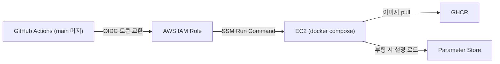

# 인프라와 배포

전체 토폴로지 그림은 [아키텍처 — Infrastructure](../architecture/infrastructure.md)에 있습니다. 이 페이지는 구현과 운영 이야기입니다.

## Terraform 구조

| 구성 | 내용 |
|:---|:---|
| 스택 | `dns`(Route 53 존 — 최초 1회) + 앱 스택(나머지 전부) 분리. 앱을 destroy해도 NS 위임 유지 |
| 모듈 | network(VPC·서브넷·S3 게이트웨이 엔드포인트) / security(SG) / compute(EC2) / database(RDS) / ingress(ALB·ACM·Route 53) / storage(사진 S3·CORS) / embedding(Lambda·ECR) — 7개 |
| State | 사전 생성 S3 backend, app/dns 키 분리, S3 native lock |
| 비밀값 | DB 비밀번호는 write-only 인자(`ephemeral` → `password_wo`)로 전달해 **state에 평문이 남지 않음** |

## 키 없는 배포 파이프라인

배포 경로 어디에도 장기 자격증명이 없습니다.



- GitHub Actions는 저장된 액세스 키 대신 **OIDC로 단기 자격증명을 교환**합니다.
- 서버 접근은 SSH 대신 **SSM Run Command** — 22번 포트를 열지 않습니다.
- 시크릿은 전부 Parameter Store에 있고 EC2가 부팅 시 읽습니다. → [ADR-006](../decisions/adr-006-keyless-deploy.md)

embedder(Lambda)는 앱과 **배포 경로가 다릅니다.** 앱 CD는 embedder를 건드리지 않고, `terraform apply`도 코드를 내보내지 않습니다(`ignore_changes = [image_uri]` — 인프라는 저장소·함수·IAM만 관리). 코드 배포는 전용 스크립트가 이미지 빌드 → ECR 푸시 → 함수 갱신 → 반영 확인까지 수행합니다.

## 제로 상태에서 배포 순서

폐기 후 재구축을 전제로, 순서가 문서화되어 있습니다.

```
[1] dns 스택 (최초 1회)        — Route 53 존 + NS 위임
[2] SSM 수동 파라미터 등록      — DB 비밀번호, OAuth, CORS 등
[3] ECR만 먼저 apply → 이미지 푸시 — Lambda는 빈 ECR 상대로는 만들어지지 않는다
[4] 앱 스택 terraform apply    — VPC/ALB/EC2/RDS + S3 + Lambda + 배포 롤
[5] 배포 롤 ARN을 서버 저장소 시크릿에 등록
[6] 서버 저장소 main 머지       — CD가 빌드 → GHCR → SSM 배포 (Flyway가 스키마 생성)
[7] 임베딩용 DB 사용자 생성     — photos 테이블이 생긴 뒤 1회 (Terraform이 못 하는 부분)
[8] 검증                       — 헬스체크 · OAuth · 업로드
```

## 운영 중 겪은 사건들

{: .warning }
> **조직 SCP가 RDS IAM 인증을 막다**
>
> embedder의 DB 접속은 원래 **RDS IAM 인증**으로 설계했습니다 — 15분짜리 토큰을 로컬 서명으로 만들기 때문에 NAT도 엔드포인트도 없는 DB 서브넷에서 비밀번호 없이 접속할 수 있고, 비밀번호가 어디에도 남지 않습니다.
>
> 그런데 조직 SCP(Service Control Policy)가 계정 전체에서 `rds-db:connect`를 거부했습니다. 계정 관리자인데도 막힌다는 것이 곧 멤버 계정이라는 증거였고(SCP는 관리 계정에는 적용되지 않으므로), 멤버 계정 안에서는 풀 수 없는 제약이었습니다. 판별은 IAM 정책 시뮬레이터로 했습니다 — **`MatchedStatements`가 비어 있는데 `explicitDeny`** 라면 계정 내 어떤 정책도 거부하지 않았다는 뜻이므로 거부는 조직에서 온 것입니다.
>
> 결국 비밀번호 인증으로 임시 전환하되, 비밀번호를 Terraform이 주입하면 state에 평문이 남으므로 **apply 밖에서 한 번 주입하고 `ignore_changes`로 지키는** 방식을 택했습니다. SCP가 풀리면 되돌리는 원복 절차까지 런북에 함께 기록해 두었습니다.

{: .warning }
> **GRANT 누락 — 코드가 배포되는 날 터진다 (2026-08-14)**
>
> embedder의 DB 사용자를 만들 때 `galleries` 테이블 SELECT 권한을 빠뜨렸습니다. 당시 코드는 그 테이블을 읽지 않아 아무 문제가 없었지만, 휴지통에 들어간 갤러리를 거르는 코드가 배포되자 임베딩이 권한 오류로 전량 실패했습니다. "권한 누락은 그 권한을 쓰는 코드가 배포되는 날 터진다"는 교훈이 런북의 사용자 생성 절차(필요 GRANT 목록 포함)로 남았습니다.

## 의도된 한계

이 인프라는 **폐기 가능한 테스트 환경**으로 명시되어 있습니다 — Single-AZ, 백업·스냅샷·삭제 보호·오토스케일링 없음. 목표 아키텍처와의 간극(CDN, 모니터링 대시보드 등)은 [System 아키텍처의 차이 표](../architecture/system.md#목표-설계와-현재-구현의-차이)에서 관리합니다.
