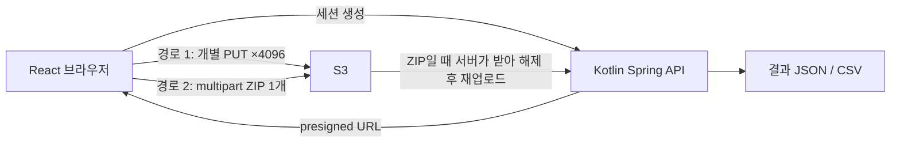

# PoC — 설계를 결정한 두 실험

수십 MB짜리 사진 수천 장을 다루는 서비스에서 업로드와 열람은 감으로 설계하기에 너무 비싼 결정이었습니다. 본 개발 전에 PoC 두 건으로 **측정하고 결정**했고, 두 실험의 결론이 현재 프로덕션 설계의 근거입니다.

## 실험 1 — 업로드: 개별 PUT인가, ZIP인가

*WES-Upload-PoC · 2026-07-10~11 · LocalStack S3*

약 5MiB 이미지로 구성된 동일한 20GiB 데이터셋(약 4,096장)을 두 경로로 업로드해 속도 · 요청 비용 · 재시도/실패 · 사용 가능 시점을 비교했습니다.

| 비교 축 | 개별 presigned PUT | ZIP + 서버 해제 |
|:---|:---|:---|
| 전송 단위 | 파일별 독립 | 아카이브 1개 (multipart) |
| 실패 시 | 실패한 파일만 재시도 | 아카이브 단위 영향 |
| 사용 가능 시점 | 파일별 즉시 | 서버 해제 완료 후 |
| 서버 부담 | 없음 (바이트 무경유) | 다운로드 + 해제 + 재업로드 |

**채택: 개별 presigned PUT.** 파일 단위 재시도·진행률이 가능하고 서버가 이미지 바이트를 만지지 않는 경로가 서비스 요구(업로드 진행률 표시, 부분 실패 복구)와 맞았습니다. 이 결정이 현재의 3단계 업로드 파이프라인(발급 → 직접 PUT → 완료 통지)입니다. → [ADR-001](../decisions/adr-001-presigned-direct-upload.md)

## 실험 2 — 열람: 40MB 원본을 어떻게 넘겨볼 것인가

*WES-ImageLoad-PoC · 2026-07-25~28 · 실제 S3 (CDN 없음) · 82런, 8,200 측정 레코드*

뷰어에서 사진을 연속으로 넘길 때의 로딩 전략을 시나리오(원본 직로드 / 썸네일→원본 / 썸네일→표시용 파생본) × 정책(디바운스 · 프리페치 · 썸네일 선로드) 전 조합으로 측정했습니다.

### 선명한 이미지가 뜰 때까지

{: .poc-chart }

- 40MB 원본을 넘김마다 로드하는 방식은 **3.1초** — 성립하지 않습니다.
- 표시용 파생본(2048px WebP) 전환만으로 **414ms — 7.5배** 단축.
- 프리페치 1장(디코드 선행)을 더하면 **103ms**, 그리고 p95가 482→114ms로 안정화 — 프리페치의 효과는 평균이 아니라 **꼬리 지연 제거**에서 나타납니다.

### 넘기는 순간 무언가 보일 때까지

{: .poc-chart }

그리드에서 이미 로드된 썸네일을 뷰어가 재사용(선로드)하면 첫 표시가 **21~22ms로 수렴** — 사실상 즉시입니다.

### 빠른 연속 넘김 내성 — 디바운스 단독의 함정

{: .poc-chart }

{: .poc-chart }

- 파생본 전환이 원본에서 0%였던 700ms 연타 완료율을 99%로 살립니다.
- **디바운스 250ms를 단독 적용하면 완료율이 70%로 떨어집니다** — 대기가 시간 예산을 잠식하기 때문. 하지만 낭비 전송(보여주지도 못할 원본을 받다 버리는 트래픽)을 크게 줄입니다.
- **프리페치와 결합하면** 완료율 100%를 회복하면서 낭비 절감만 남습니다. 정책은 단독이 아니라 조합으로 평가해야 한다는 것이 이 실험의 교훈입니다.

### 남은 병목

{: .poc-chart }

정책을 다 써도 파생본 한 장의 순수 비용은 TTFB 82 + 다운로드 194 + 디코드 113 = **389ms**이고, 지배 항은 네트워크(276ms)입니다. 다음 단축 수단은 클라이언트 정책이 아니라 인프라 — CDN(TTFB)과 AVIF(다운로드)입니다.

### 최종 권고

**썸네일 선로드 + 표시용 파생본 + 프리페치 1~2장(디코드 선행) + 디바운스 200~300ms.** 이 조합으로 paced 열람 첫 표시 22ms · 파생본 114ms, 700ms 연타 완료율 100%, 낭비 전송 ~0을 얻습니다. 원본은 줌 진입 시에만 로드합니다.

## 실험이 제품에 반영된 것

- **파생본 우선 로딩**이 설계 기반이 되었고, 파생본 생성은 [embedder의 단일 잡](ai-pipeline.md)에 통합되었습니다 — 임베딩을 위해 어차피 디코딩한 이미지를 그대로 JPEG로 인코딩해 저장합니다.
- 프론트엔드 그리드는 파생본(`viewUrl`)과 "미리보기 준비 중" 상태를 표시하고, URL 만료 시 재조회합니다.
- CDN·AVIF는 측정으로 확인된 후속 과제로 남겨 두었습니다.

{: .note }
PoC의 파생본 규격(2048px WebP + 512px 썸네일 2종)과 현재 구현(1024px JPEG 단일본, 장당 약 200KB)은 다릅니다. 현재 구현은 임베딩 리사이즈 크기를 재사용하는 최소 구성이고, PoC가 권고한 2단 파생본 체계는 CDN 도입과 함께 검토할 다음 단계입니다. → [ADR-002](../decisions/adr-002-preview-derivatives.md)
