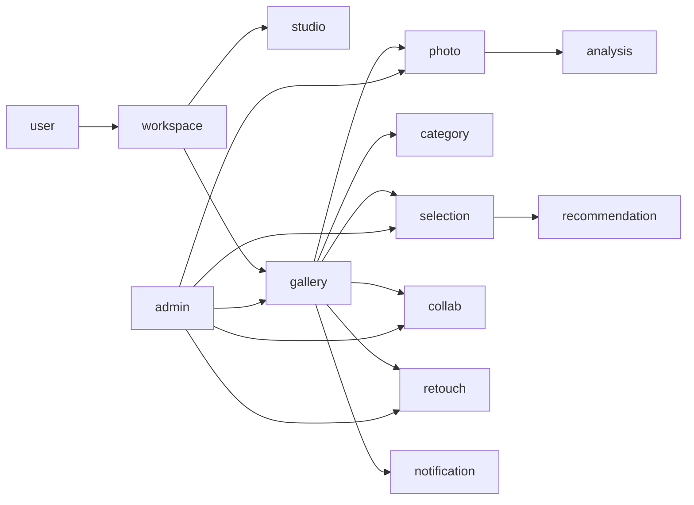
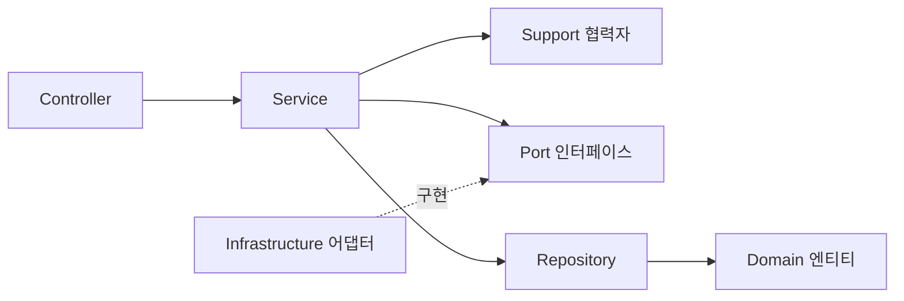

# 백엔드 — Kotlin / Spring Boot

## 스택

| 항목 | 선택 |
|:---|:---|
| 언어 · 런타임 | Kotlin 2.3.21 · JVM 21 |
| 프레임워크 | Spring Boot 4.1.0 — Servlet MVC (WebFlux 아님) |
| 영속성 | JPA + PostgreSQL. **스키마는 Flyway 소유** (`ddl-auto=validate`) |
| 벡터 | pgvector — 로컬·테스트도 동일한 `pgvector/pgvector:pg16` 이미지 |
| 인증 | Spring Security + OAuth2 (구글·카카오·네이버) + JWT |
| API 문서 | springdoc-openapi — 애노테이션은 `controller/docs`의 별도 인터페이스로 분리 |
| 테스트 | JUnit 5 + Testcontainers (실제 PostgreSQL로 통합 테스트) |
| 설정 | 시크릿과 인프라 파생 값은 시작 시 AWS Parameter Store에서 로드 |

---

## 도메인 단위 수직 슬라이스

패키지는 기술 레이어가 아니라 도메인으로 나눈다. 현재 최상위 패키지는 다음 책임을 가진다.

| 도메인 | 책임 |
|:---|:---|
| `auth`, `user` | OAuth2/JWT 인증과 전역 역할 없는 사용자 계정 |
| `workspace`, `studio` | PERSONAL/STUDIO 작업공간, 다중 구성원과 OWNER 수명주기 |
| `gallery`, `photo` | 작업공간 소유 갤러리, 초대, 상태와 presigned 사진 업로드 |
| `analysis`, `category` | 외부 AI 작업 계약과 컨셉·세부·사진 배정 |
| `selection`, `recommendation` | 갤러리 생성 시 생기는 셀렉, 별점과 추천 초안 |
| `collab` | 사용자·게스트 통합 참여자, 댓글과 좋아요 |
| `retouch` | 고객 요청과 스튜디오 결과 처리 |
| `notification`, `trash` | 사용자 알림, 논리 삭제·복원·purge |
| `admin` | 별도 관리자 인증·감사·멱등 작업·휴지통·재처리 |
| `global`, `security` | 공통 예외·페이징과 공개 JWT 필터 체인 |

## 도메인 의존 개요

## 마이그레이션과 계약

- `V1`은 운영 기준선이다. 수정하거나 초기화하지 않는다.
- `V3`과 `V4`는 분석 결과와 작업 단계를 분리했다.
- `V5`는 작업공간 소유권, 카테고리·셀렉 메타데이터와 통합 협업 참여자를 확장했다.
- `V6`는 카테고리·셀렉의 복합 FK와 NOT NULL, 통합 참여자 참조를 확정한다.

Flyway가 스키마를 소유하고 Hibernate `validate`가 코드와 스키마의 차이를 배포 전에 막는다. 현재 전체 ERD는 [데이터 모델](../data-model/index.md)에 있다. [구현 기준과 확인 상태](../implementation-status.md)의 원격 SHA와 배포 기록을 기준으로 한다.

## 공개 API와 관리자 API

공개 제품 API는 `/api/v1` 아래에 둔다. 관리자 API는 `/internal/admin/v1` 아래에서 별도 관리자 세션·감사 정책을 적용하고 공개 ALB에 노출하지 않는다. BackOffice 최고 관리자는 조회 전용이 아니라 허용된 변경·복원·재처리를 수행한다.

---

## 레이어 흐름

모든 도메인이 같은 레이어 흐름을 따른다.

---

## 컨벤션을 코드로 관리한다

레이어별 컨벤션(컨트롤러·서비스·도메인·리포지토리·DTO·테스트 등)은 저장소의 `.claude/rules/` 아래 12개 규칙 문서로 관리한다. 파일 경로 매칭으로 해당 파일 작업 시 자동 적용되는 구조라서 사람과 AI 도구가 같은 규칙을 본다.

세부 테이블·키·권한과 상태 전이는 [기능별 데이터 모델](../data-model/index.md)을 기준으로 관리한다. 소스 클래스 수처럼 쉽게 변하는 수치는 문서 계약으로 고정하지 않는다.
