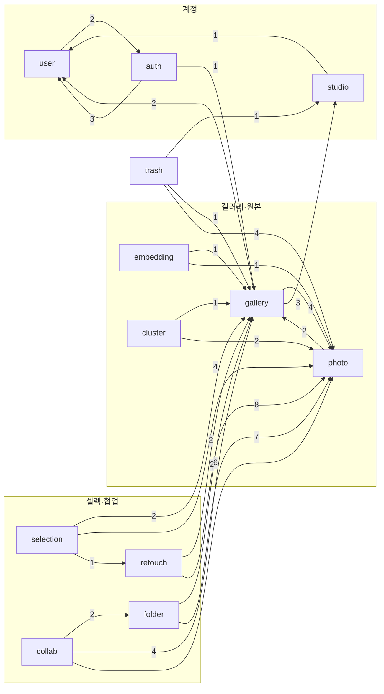
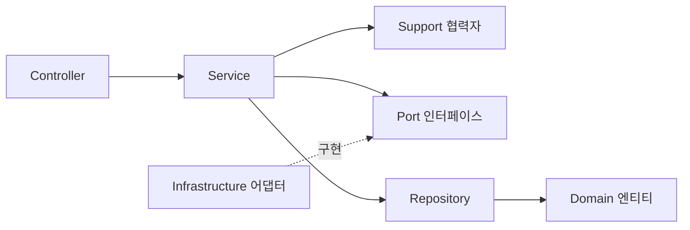

# 백엔드 — Kotlin / Spring Boot

## 스택

| 항목 | 선택 |
|:---|:---|
| 언어 · 런타임 | Kotlin 2.3.21 · JVM 21 |
| 프레임워크 | Spring Boot 4.1.0 — Servlet MVC (WebFlux 아님) |
| 영속성 | JPA + PostgreSQL. **스키마는 Flyway 소유** (`ddl-auto=validate`) |
| 벡터 | pgvector — 로컬·테스트도 동일한 `pgvector/pgvector:pg16` 이미지 |
| 인증 | Spring Security + OAuth2 (구글·카카오·네이버) + JWT |
| API 문서 | springdoc-openapi — 애노테이션은 `controller/docs`의 별도 인터페이스로 분리 |
| 테스트 | JUnit 5 + Testcontainers (실제 PostgreSQL로 통합 테스트) |
| 설정 | 시크릿과 인프라 파생 값은 시작 시 AWS Parameter Store에서 로드 |

## 도메인 단위 수직 슬라이스

패키지는 기술 레이어가 아니라 **도메인**으로 나뉩니다. 13개 도메인 + 횡단 관심사(`global`/`security`)이고, 각 도메인이 자기 controller · service · domain · repository · dto를 소유합니다.

| 도메인 | 책임 |
|:---|:---|
| `auth` | OAuth2 로그인, JWT 발급·재발급·로그아웃 |
| `user` | 사용자 계정, 역할(작가·부부) |
| `studio` | 작가 스튜디오, 슬러그 URL 정규화 |
| `gallery` | 갤러리, 초대 링크, 멤버, 상태 전환, 접근 정책, Mock 갤러리 온보딩 |
| `photo` | 원본 사진 — presigned 발급 → 직접 업로드 → 완료 통지, EXIF 메타, 별점 |
| `embedding` | 갤러리 단위 Lambda 비동기 호출 |
| `cluster` | pgvector 유사도 쌍 → Union-Find 연결 요소로 유사 사진 묶기 |
| `folder` | 폴더 그룹(부모) → 폴더(자식) 2단계 앨범 구조 |
| `selection` | 부부의 최종 선택 앨범, 최대 선택 장수 |
| `retouch` | 보정 요청 — 회차(Round) 단위 일괄 제출 |
| `collab` | 게스트 협업 세션 — 계정 없는 링크, 좋아요·댓글 |
| `trash` | 사진·갤러리 소프트 삭제(휴지통), 복원, 만료 purge |
| `global` / `security` | BaseEntity·예외·페이징 / JWT 필터 체인 |

`embedding`부터 `trash`까지 여섯은 전부 사진에 *관한* 도메인이지만 `photo`의 하위 패키지가 아닙니다 — 합치면 `photo`가 모든 것이 떨어지는 패키지가 되기 때문입니다. 같은 이유로 **최상위 `infrastructure` 패키지도 없습니다.** 외부 시스템 어댑터는 그것을 쓰는 도메인 안에 삽니다. → [ADR-005](../decisions/adr-005-monolith-vertical-slice.md)

## 도메인 의존 개요

도메인 사이의 실제 참조 관계입니다 (소스에서 자동 추출, 화살표 라벨은 참조 클래스 쌍의 수). **도메인 노드에 마우스를 올리면 그 도메인과 직접 의존 관계인 것들만 강조됩니다** — 예를 들어 `photo`에 올려 보면 사진을 참조하는 도메인이 얼마나 많은지 바로 보입니다.

## 레이어 흐름

모든 도메인이 같은 레이어 흐름을 따릅니다.

## 컨벤션이 코드로 관리된다

레이어별 컨벤션(컨트롤러·서비스·도메인·리포지토리·DTO·테스트 등)은 저장소의 `.claude/rules/` 아래 12개 규칙 문서로 관리됩니다. 파일 경로 매칭으로 해당 파일 작업 시 자동 적용되는 구조라, 사람과 AI 도구가 같은 규칙을 봅니다.

전체 클래스 구조(305개 클래스)는 소스에서 자동 추출한 도메인별 Mermaid 클래스 다이어그램으로 `WES-Server` 저장소의 `docs/architecture.md`(2,200줄)에 정리되어 있습니다. 이 문서에는 규모 문제로 발췌만 실었습니다 — 클러스터링 관련 발췌는 [AI 파이프라인](ai-pipeline.md)에 있습니다.
